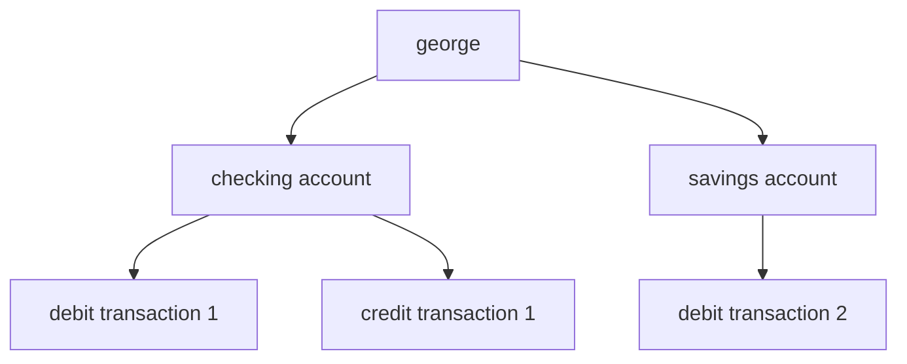

[TOC]

# Introduction to SQL

## Why SQL?

understand the data structures used to store information 

SQL *schema statements* and *data statements*.

## databases

a set of related information. database systems are some of the first computer application developed to computerize data storage and retrieval.

## non relational databases

*hierarchical database systems* were designed and used in the early days, data is represented as one or more tree structures, as shown below. we could have george, michael and etc. every user has their own tree containing their information. each node in the three may have one or zero parent and one, zero, or many child. this is also known as single-parent hierarchy.

another approach was the *network database system* which is a giant network of records and relations. traversing and locating records could be much complicated. there could exists some records (category) that can be accessed from multiple places allowing the database act as a *multiparent hierarchy*.

both approaches still exists but is less common comparatively.

## the relational models

a relational model of data for large shared data banks, E. F. Codd 1970 IBM

data are represented as tables, and redundant data is used to link records in different tables. number of columns may vary server to server but generally its never a concern. number of rows is limited by physical limits (disk drive space) and maintainability. each table should include information that uniquely identifies a row in that table (primary key, every database server provides a mechanism for generating unique sets of numbers to use as primary key values) along with additional information needed to describe the entity.

choosing existing columns as primary key would be referred as a natural key, while creating additional column as identifier is referred as a surrogate key. redundant data is separated into another table and uses primary key of the original table as the identifier, also known as the foreign key.

database normalization is a huge topic and not discussed here. (BCNF, 3NF, 5NF, 6NF)

## what is SQL

language that manipulate data in relational databases, standardized by ANSI, and it goes hand in hand with relational model because the result of an SQL query is still a table

SQL

- schema statements: define data structures stored in database, and all database elements created are stored in a special set of tables called data dictionary and is also known as metadata, there isn't much to it besides syntax
- data statements: manipulate data structures created by schema statements, this book will be focusing on this
- transaction statements: to deal with transactions

### a non procedural language

a procedural language defines both the desired results and the mechanism / process which the results are generated. a non procedural language only defines the desired results and the process of generating results is handled to a external agent. in SQL the execution is left to a component known as the *optimizer* which looks into SQL statements and taking into account how the tables are configured / indexes available and decide a(n) (most) efficient execution path. optimizer's behavior can be influenced by specifying *optimizer hints*. 

when we are constructing our query, we generally determine which table or tables needed and add them to *from* clause, then *where* clause to filter data, and finally *select* the columns from the table(s) we are interested in.

note: if we are updating / modifying the records with where clause, we must ensure the statement is modifying exactly one or zero row. this can be verified with the database feedback / output