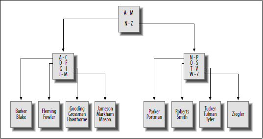

[TOC]

# indexes and constraints

## indexes

in any insert action, the database server does not just put the data in any location within the table, neither it put it in numeric / alphanumeric order of any column. instead it simply place the data in the next available location within the file. (server maintains a list of free space for each table) 

when we query the table, the server need to inspect every row of the table to answer to the query and appends the matching row into the result set. this is known as table scan. table scan is inefficient as the approach it takes. indexes came in place to resolve this issue, which index allows database server to locate rows in table. indexes are special table that kept in specific order. index contains only the column used to locate rows in the data table along with the information describing where the rows are physically located. thus the role of indexes is to facilitate the retrieval of a subset of table row and column without the need of inspecting every row in the table.

### index creation

```sql
ALTER TABLE department
ADD INDEX dept_name_idx(name)
-- to remove
DROP INDEX dept_name_idx
```

adding index to name column. the statement creates an index or B-tree index to be precise in the department.name column with the given name dept_name_idx. with this in place, the query optimizer can choose to use the index if its deemed beneficial to do so. a few situations where index(s) might not be selected,

- total row number is small
- there exists another index that performs better

usually primary key will be selected as an index during creation.

### unique indexes

to enforce no duplicated column value. its both to provide the benefits of a regular index and disallowing duplicate values in the indexed column

```sql
ALTER TABLE department
ADD UNIQUE dept_index_idx(name)
```

there is no point to make primary key column unique index, but we could have multiple unique index in a table

### multicolumn index

```sql
ALTER TABLE employee
ADD INDEX emp_index_idx(fname, lname)
```

it would be beneficial to situation where we query both fname and lname OR just fname but NOT lname.

## types of indexes

there exists many type of data thus single indexing strategy doesn't always do the job.

### B-tree indexes

or balanced-tree indexes is the default indexing.



above is the example of employee.lname B-tree. as more data is being inserted, the database server will try balance the index tree by adding or removing branch nodes to distribute the nodes / values evenly. ? (i recall seeing a slightly different tree structure where leaf node are connected from left to right, **that's a B+ tree**) if we are searching for 'Germaine' thus goes A-M then G-I and the search will stop at H*. as expected we should be expecting on average log(n) search time

### bitmap indexes

for some unbalanced columns its better to not use B-tree index eg. we only have 8 product some product are far popular than others, this will lead to unbalanced tree. for such column that contains small number of values across large number of rows (low-cardinality data) a different index strategy is needed. bitmap index is similar to one hot index but instead it concatenated all rows into a single bitmap.

this is generally a good strategy when we can maintain the column data as low-cardinality. a high cardinality example would be primary key column

### text indexes

if the database stores documents and if we would like to allow search for text within the document, full-text search is an option.

## how indexes are used

```sql
EXPLAIN SELECT cust_id, SUM(avail_balance) tot_bal
FROM account
WHERE cust_id in (1, 5, 9, 11)
GROUP BY cust_id
--
/*
possible_keys: fk_a_cust_id
keys: fk_a_cust_id
key_len: 4
ref: NULL
rows:24
Extra: Using WHERE
*/
--
ALTER TABLE account
ADD INDEX acc_bal_idx(cust_id, avail_balance)
--
/*
possible_keys: acc_bal_idx
keys: acc_bal_idx
key_len: 4
ref: NULL
rows: 8
Extra: Using WHERE; Using index
*/
```

the first query use fk_a_cust_id to find rows that satisfy the where clause, after reading the index server is expected to read all rows from table to gather the available balance data as it doesn't know if there exists other cust_id other than the four.

the second query uses the new index instead of the original one and only need to read eight row instead of 24. also table is not needed (designated by Using index)

this is just an example showed in the text book, its advised to read on the server tuning guide or a good tuning book.

## downside of indexes

index is still a table, thus any modification all index on that table must be modified, this leads to server slow down if not handled properly. like any information stored, index also takes up disk space. an approach would be to create index when needed and drop it as soon as there is no need for it. a good balance is something to work towards to, a rule of thumb would be

- make sure all primary key are indexed. for multicolumn primary key, consider building additional index on a subset or / and a different order of all primary key
- build index on all columns that referenced in foreign key constraints. during deletion, server will scan entire table to make sure there are no child rows when a parent is deleted. a query will be issued to ensure that, thus the scan
- index any column that will frequently used to retrieve data, dates is one and some short string column (3 - 50 chars) would be good

## constraints

its a simple restriction placed on one or more column

- primary key constraints
  - identify column(s) that guarantee uniqueness within a table
- foreign key constraints
  - restrict column(s) to contain only values found in another table's primary key columns, and may also restrict the allowable values in other table if `update cascade` or `delete cascade` rules are established
- unique constraints
  - restrict column(s) to contain unique values within a table (primary key is a special unique constraints)
- check constraints
  - restrict the allowable values for a column

with constraints we can prevent modification in one table that is reference by in another table (orphaned row), error will be raised or changes will be propagated

### constraints creation

constrains are created in the `create table` statement

```sql
ALTER TABLE product
ADD CONSTRAINT pk_product PRIMARY KEY (product_cd)
ALTER TABLE product
ADD CONSTRAINT fk_product_type_cd FOREIGN KEY (product_type_cd)
	REFERENCES product_type (product_type_cd)
--
ALTER TABLE product
DROP PRIMARY KEY
--
DROP FOREIGN KEY fk_product_type_cd
```

> all in all, know you database on how constraints interact with indexes, some auto generates some doesn't

## cascading constraints

with foreign key constraints in place, insertion or modification of row with foreign key column value doesn't exists in the reference table primary key column database will raise error. to preserve data integrity and exclude this error we can use cascading update where foreign key can be installed by removing existing foreign key and adding a new one that includes the `on update cascade` clause

```sql
ALTER TABLE product
DROP FOREIGN KEY fk_product_type_cd

ALTER TABLE product
ADD CONSTRAINT fk_product_type_cd FOREIGN KEY (product_type_cd)
	REFERENCES product_type (product_type_cd)
	ON UPDATE CASCADE
	ON DELETE CASCADE
```

