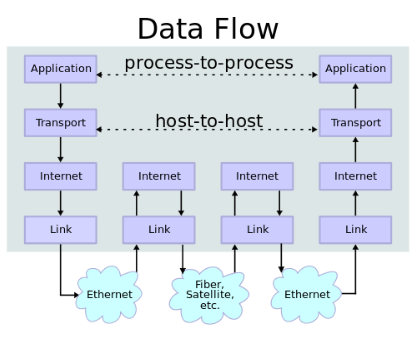

# Internet Protocol Suite

also known as TCP/IP is a set of communication protocols used in the internet and similar computer networks. the foundational protocols includes transmission control protocol, internet protocol and user datagram protocol. this protocol suite provides end to end data communication specifying how data should be packetized, addressed, transmitted, routed and received. its abstracted into four layers, the link layer, the internet layer, the transport layer and the application layer.

## TCP/IP Abstract Layers

### Link Layer

containing communication method for data that remains within a single network segment. defines the networking methods within scope of local network link on which host communicate without intervening router. this layer includes the protocols used to describe the local network topology and the interfaces needed to affect the transmission of internet layer datagrams to next-neighbour hosts. the size is determined by the networking hardware design. TCP/IP is designed to be hardware independent and allows implementation above any virtual link layers technology.

it moves packets between internet layer interfaces of two different host on the same link. this process of transmitting and receiving packets can be controlled in the device driver of the network card. the TCP/IP model includes specifications for translating the network addressing method used in the internet protocol to link-layer (OSI) addresses such as MAC address. all other aspects below that level are implicitly assume to exists but not explicitly define in the TCP/IP model.

> network topology essentially is the arrangement of elements of a communication network.

### Internet Layer

providing internetworking between independent network by exchanging datagrams across network boundaries. provides a uniform networking interface that hides the actual network topology. established internetworking and internet. defines the addressing and routing structures used for TCP/IP protocol suite. the primary protocol Internet Protocol defines IP addresses. by routing datagrams to next host as a IP router, such that its transmitted to a network closer to the final data destination.

routing is defined by sending data from source to destination network and is supported by host addressing and identification using hierarchical IP address system. provides an unreliable datagram transmission facility between hosts located on potentially different IP networks by forwarding datagrams to an appropriate next-hop router for further relaying to its destination across multiple network.

the layer does not distinguish bewteen varous transprort layer protocols. it caries a varietly of different upper layer protocols. these protocols are identified by a unique protocol number eg internet controll message protocol and internet group management protocol.

internet protocol is the principal component of this layer which defines two addressing system to identify network host and locate them on network. IPv4 (32 bit IP address) and IPv6 (128 bit IP address).

#### IP header

header information found at each IP packet. contains IP version, source IP address, destination IP address, time-to-live etc. IPv4 includes 13 mandatory fields and is as small as 20 bytes, with a 14th optional and infrequently used field that increases the header size.

### Transport Layer

handling host to host communication on local network or remote network separated by routers. provides channel for communication need of application. connection oriented trasnport layer TCP, connectionless is implemented by UDP. established concept of network port, a logical construct allocated specifically for each communication channels an application needs. many service's port number has been standardized such that client may address specific service without the need of service discovery. only provides best-effort delivery, reliability is bonus.

> reliability is done through checksum error detection

UDP is used when on time delivery is much important than reliability or simple query/response eg. DNS lookup which the overhead of setting up reliable connection is disproportionately large.

| TCP | UDP |
|-----|-----|
| secure | unsecure |
| connection oriented | connectionless |
| slow | fast |
| guaranteed transmission | no guarantee |
| used by critical application | used by real time application |
| packet reorder mechanism | no reorder mechanism |
| flow control | no flow control |
| advanced error checking | basic error checking (checksum) |
| acknowledgement mechanism | no acknowledgement |
| handshakes | no handshakes |

### Application Layer

process to process data exchange for application. scope within application or processes, create user data and communicate this data to other application on other hosts. the communication parters are characterized by the application architecture eg. clent-server model or p2p mode. its a combination of OSI's 5th to 7th layer. however it does distinguish between user protocols and support protocols. support protocols provides services to a system of network infrastructure. user protocols are used for actual user applications. one can assume that application layer treats transport layer and below layers as a black box that provides stable connection to communicate.

### key principles

- end to end: to put state maintenence and overall intelligence at edge, assume the internet that connected the edges retained no state and concentrated on speed and simplicity. real-world need for firewalls, network address tranalators, web content caches which changes the principle
- robustness: implementation must be conservative in its sending behavior and liberal in its receiving behavior. it must be careful to end well-formed datagrams but must accept any datagram that it can intepret. [rfc1122](https://datatracker.ietf.org/doc/html/rfc1122#page-13)
- encapsulation: used to provide abstraction of protocol and services. usually aligned with the division of protocol suit into layers of general functionality. protocol helps to further encapsulates at each level.

## IP address

a numerical label that is connected to a computer network that uses internet protocol for communication. it serves two main function network interface identification and location addressing. IP address space is managed globally by internet assigned numbers authority and by five regional internet registries reponsible in their designated territories for assigning local internet registries eg. internet service providers and end users. network administrators assigned IP address to each device connected to the network and can be static or emphemeral.

### Subnetwork

a subnet is a logical subdivision of the IP network. such logical division of IP address results in two fields, network number/routing prefix and rest field/host identifier (identifier for specific host or network interface). routing prefix can be expresed in classless interdomain routing (CIDR) notation eg. 193.256.1.23/24 (/24 is the subnet mask), which having 24 bits allocated for network prefix and 8 reserved for host addressing. the result of **bitwise AND** of IP address and subnet mask is the network prefix. the host part is derived by **bitwise AND** operation of the address and the one's complinent of the subnet mask 

any computer participating in a network eg internet have at least one network address which usually is unique to each device and is either configure by DHCP, manually or stateless address autoconfiguration. all host on the same subnet have the same network prefix and they have the most-significant bits of the address. this addressing structure permits the selective routing of IP packets across multiple networks via special gateway a.k.a. routers to destination host if the network prefix of origination and destination host differ, or directly to target host on a local network. routers manages the traffic between subnets "borders" (physically/logically).

why subnetting? to prevent mass broadcasting, which will significantly slow down communication. subnetting is the process of designating some high-order bits from the host part as part of network prefix and adjust the subnet appropriately. for each bit used for the network prefix, number of network increases (from 1 - 128) and the number of host decreases (from 254 - 1, excluding all zeros and all ones)

#### Network Address Translation

not all computer connects to the Internet, eg factory machines that only communicate with each other via TCP/IP, thus requires a globally unique IP address. such private network are widely used and when needed to connect to the Internet, a network address translation is used.

NAT maps an IP address space into another by modifying network address information in the IP header of the packets while they transit across a traffic routing device.