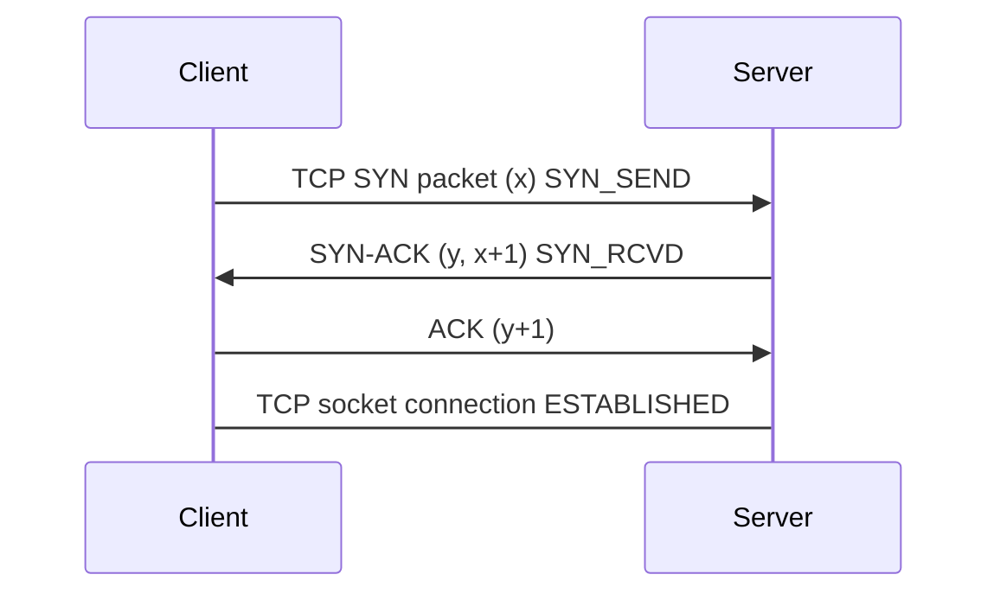
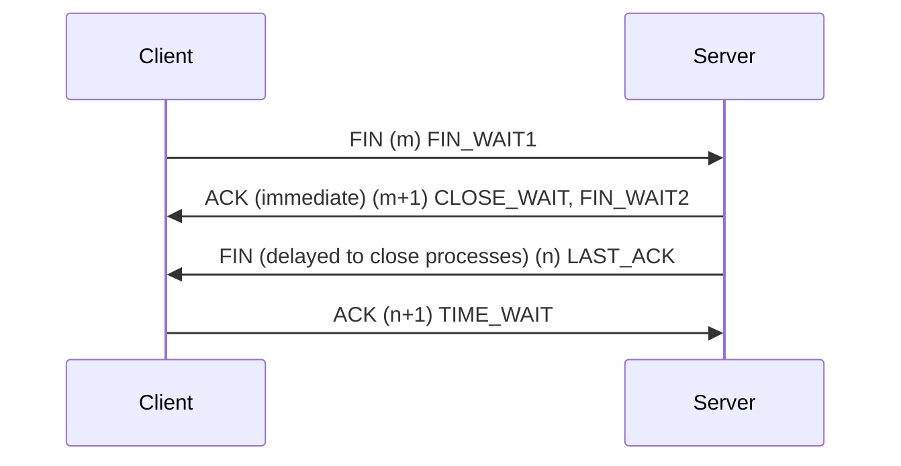
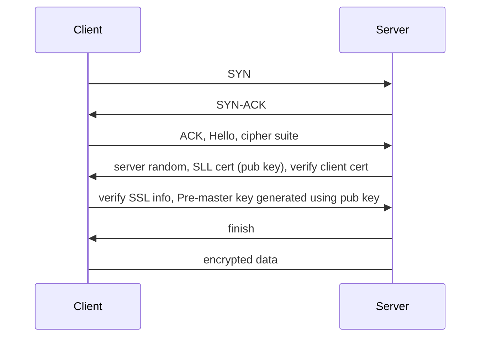
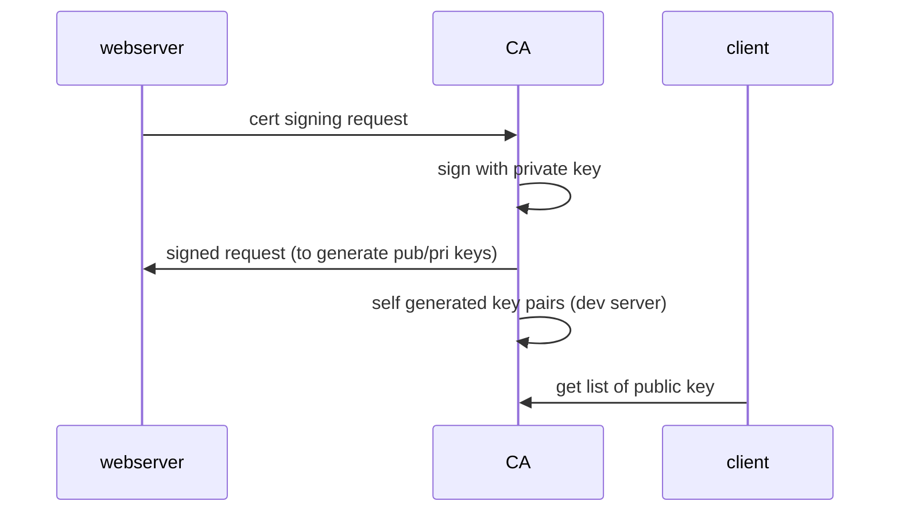

[TOC]

# questions

## 1. explain request-response cycle

client sends a request  for some data and the server response to the request. for simplicity its usually implemented in synchronous fashion (ie connection is opened and waits until the response is delivered or timeout)

## 2. explain TCP-handshakes

TCP is a transport layer host to host protocol for connection oriented communication between machines over IP network. usually its a three-way handshakes to establish connection in short **SYN -> SYN-ACK -> ACK** (synchronize and acknowledge) and a four-way handshakes to terminate connection **FIN -> ACK -> FIN -> ACK**. the working mechanism is design such that two machines that want to pass message back and forth to each other can negotiate the parameters of the connection before transmitting data such as HTTP browser request.

> ISN (initial sequence number) is a value selected prior to the first SYN message. its a dynamic number, or one can see it as a 32 bit counter where every 4ms it increments by one to prevent network delay and resending packets with same sequence number and to prevent attackers guessing the subsequent sequence number

> all handshakes happens **after** DNS lookup and **before** TLS handshake when creating a secured connection

### 2.1 establish communication

### 2.2 why 3-way handshake?

the third ack is not redundant to prevent lagged connection, eg. first SYN is delayed, thus client sent another SYN packet and successfully establish connection. then the first SYN is received by the server end, and attempt to establish a **new** connection thus in total we would have established two connection which is a waste of resource.

### 2.3 terminate connection (can be initiated from both ends)

### 2.4 more on syn-ack

there exists two queues, semi-connection and full connection. once the server received client SYN, it will be in SYN-RCVD state and the server will place it into the semi-connection queue. only after receiving the second ACK from client then it will be place to the full connection queue. if the client didn't receive the second ACK signal from client the server will attempt to resend SYN-ACK until maximum attempts (config) with exponential delay.

### 2.5 data packet

first two handshakes should not have data packet to prevent malicious attack by flooding with enormous SYN packets (including data packet) in short burst.

### 2.6 SYN-attack

by flooding server with large volume of SYN packet through forged IP. this results large volume of queued item in the semi-connection queue pending to resend SYN-ACK, however these IP are forged or basically doesn't exists thus effectively prevent more items to be queued into the semi-connection queue.

solutions:

- resolve with SYN-Cookies
- minimize SYN Timeout
- limit maximum semi-connection queue size
- other protection mechanism / gateway

### 2.7 why 4-way handshakes?

server might have logic to handle sudden connection closure eg. processing some information, thus the first ACK is to inform that the close connection request is received, the socket is still remained connected until the FIN is sent by the server.

### 2.8 2MSL waiting state

TIME_WAIT or 2MSL wait state (maximum segment lifetime). its the time a TCP segment can exists in the internetwork system before discarded. when TCP executes a closing operation and response with the final ACK, the connection must wait for 2MSL to prevent the final ACK package lost. if there exists no 2MSL, when the server resend FIN-ACK the connection was single sided closed on the client end thus server can't be close properly. also if the lost final ACK reappear in the network system as long as it expires the 2MSL it will be discarded.

## 3. explain TLS handshakes (SSL)

TLS handshake is a process that kicks off a communication session that uses TLS encryption. during the handshake, two communicating sides exchanges messages to acknowledge and verify each other and then establish the encryption to be used and agree on session keys. can be used on top of any low level transport but its original goal is to secure HTTP traffic.

TLS provides

- authentication - verify the other party is who they claim to be
- encryption - data is encrypted to prevent MITM attack
- integrity - ensure encrypted transmission and decryption of data, no data loss, damaged, tampered or falsified.

verifying SSL / client certificate info / Certificate Authority public key

## 3. how pub/pri key works?

asymmetric cryptography uses pairs of keys generated from a one way function such that only the private key can decrypt whatever is encrypted by the public key. for two party communication what could be done its where A's public key + B's private key forms a shared secret between A and B and vice versa. also its possible to sign a message with a private key, such that we could verify the integrity of the message with the corresponding public key.

## 4. http post vs http get

http post request are never cached, don't remain in browser history, cant be bookmarked and no data length restrictions, thus its highly advised to use post request to deal with sensitive data. get is only good for retrieving / requesting data. however post is not encrypted, thus it can be sniffed and intercepted, or leaked through logging. to avoid this use SSL / TLS to ensure encryption.

## 5. explain MVC concept

divides related program logic in to three interconnected elements. its done to separate internal representation of information from the ways information is presented. model could be a data access object, or some abstraction that directly manages data. controller accepts input and converts it to commands for model or view.

## 6. session and cookies (http)

## 7. tokens

## 8. state