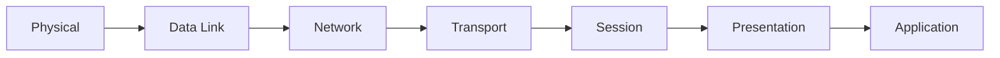

# OSI Model

its a conceptual model that provides a common basis for the coordination of standards development for the purpose of systems interconnection.

> a simple example is GCP provides load balancing options at L7 application or L4 SSL

the model partition the flow of data in a communication into seven abstraciton layers to describe network communication from physical bits transfer to highest level representation of data. each intermediate layer serves a class of functionality to the layer above and below it. each layer has it own well-defined function. there are two major components, the abstract model of networking and a set of specific protocols. it standardized network concepts and stop the protocol war.

communication protocols enable an entity in one host to interact with a corresponding entity at the **same** layer in another host. at each level, two entities at the communicating devices exchanges protocol data units (PDU) by means of layer N protocol. each PDU contains a payload or service data unit along with the protocol related headers or footers. from bottom up, each layer abstracts complexities through the services on implemtation. same layer can do a peer-to-peer communication.

physical to network are considered as media layers and transport to application are considered as host layers.

## the seven layers

| layer | PDU | Function | detail |
|-------|-----|----------|--------| 
| application | data | high level protocol for resource sharing or remote file access eg. HTTP | provides function including file sharing, message handling and database through common protocol eg HTTP, FTP, SMTP etc. |
| presentation | data | translation of data between networking service and application including character encoding, data compression and encryption/decryption | establishes data formatting and translation into format specified by applicaiton layer during encapsulation of outgoing messages while being passed down the protocol stack and vice versa. handles protocol conversion, data encryption, data compression etc. one example from JSON object to python data structure. |
| session | data | managing communication sessions eg continuous exchange of information in form of multiple back and forth transmission between two nodes | creates, setup connection and ends the teardown bewteen two or more nodes. DNS and other name resolution happens at this layer, the layer also offers login, name lookup and logoff function. with that, FTP and NFS clients are built with auth. provides simples/full or half duplex operation. also support data streaming. |
| transport | segment, datagram | reliable transmission of data segments between points on network including segmentation, acknowledgement and multiplexing | provides functional and procedure means of transferring variable-length data sequence from a source host to destination host across a network while maintaining the quality of service functions. can be conneciton-oriented or connectionless. max transmission unit defined in network layer is 1500 bytes, TCP header is 20 byers min and IPv4 header is 20 bytes min thus actual message can only be 1460 bytes. TCP performs segmentation and reassembly on receiving side while UDP does not. transport layer also control reliability of a give link between source and destination through flow control, error control and acknowledgements of sequence and existence. transport layer can keep track of segments and retry for failed segments. this however is not a strict requirement. five class of connection mode transport protocol from class 0 (least feature eg no error recovery) to class 4 (designed for less reliable network eg internet). note TCP/UDP/TLS does not strictly conforming to OSI model, categorizing them here is out of convenience. |
| network | packet | structuring and managing multi-node network, including addressing, routing, and traffic control | provides functional and procedural means of transferring packets from one node to another connected in different/heterogeneous network. a network is a medium to which many nodes can be connected and have its unique address that permits message transfer by providing message and address of destination node. network itself will find the way to deliver to destination node, possibly routing through intermediate nodes. routing can be static or dynamic. if the message is too large, it will be chuncked into several chuncks. each chunk is transmitted independently which may or may not report delivery errors. message delivery at this layer is not guaranteed to be reliable, it can be but not needed.|
| data link | frame | transmission of data frames between two nodes connected by a physical layer | node to node transfer. detects and possibly correct error that may occur at physical layer. defines the protocol to establish and terminate connection between two psysically connected devices together with protocol for flow control between them. IEEE 802 further splits it into two layer. media access control (MAC) layer is responsible for controlling how devices in a network gain access to a medium and permission to transmit data. logigal link control (LLC) layer is responsible for identifying and encapsulating network layer protocols and controls error checking and frame synchronization. 802.3 Ethernet/802.11 WIFI operates at this layer. |
| physical | bit, symbol | tranmission and reception of raw bit streams over a physical medium | transmit and recept unstructured raw data between device such as network interface controller, ethernet hub, network switch. converts digital bits to electrical signals. layer spec defines voltage levels, timing of voltage changes, bit rate etc. bit rate control may define tranmission mode to be simplex, half duplex or full duplex. well known spec including bluetooth, ethernet and USB. also specifies how encoding occurs at physical layer eg. voltage or pulse thus common problems are often noise scrambling, incorrect media termination etc. |

## understanding the layers

from a key design issues perpective
- connection management
- error control
- flow control
- congestion control
- disassembling/reassembling/sequencing
- routing