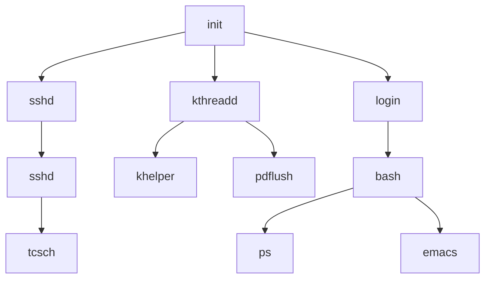
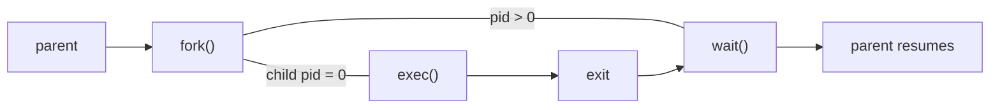

[TOC]

# Process

is an instance of a program executed by one or more threads. it contains program code and its activity. a computer program contains a collection of instructions, and a process is the execution of those instruction after its being loaded from disk to memory. its possible to open up multiple instance of the same program and more often results in more than one process being executed.

multitasking is a method to allow multiple processes to share processors (CPU, note the differences) and other system resources. each core executes a single process at a time. however multitasking allows each processor to switch context (preemption) between processes. a common form of multitasking is provided by CPU's time-sharing (method to interleaving the execution of user's / kernel processes and threads.

a computer system process consists of

- an image of the executable machine code associated with a program
- memory that includes executable code, process-specific data (stack), heap to hold intermediate computation data generated
- os descriptors of resources allocated to current process
- security attributes eg owner and permissions
- processor state eg registers and physical memory address

the OS holds most of the information about active processes in data structure called process control blocks. any subset of the resources may be associated with each process's threads in OS that supports threads or child processes. processes are isolated to reduce the likeliness of interfering each other and causing system failures. inter-process communication is possible.

## 1. more on process

### 1.1 time-sharing

sharing of computing resources among many users at the same time by means of multiprogramming and multitasking. the idea was if given an optimal group size, the overall process could be very efficient, time spent for waiting could be granted to other users. this is possible due to a typical pattern of interaction is user provides a bursts of information and followed by long pause.

### 1.2 process control blocks

stores process specific information

- process state
- process ID
- CPU registers and program counter
- CPU-scheduling information - eg priority information and pointers to scheduling queue
- memory management information
- accounting information
- IO status information

### 1.3 process memory

- executable code is read from non-volatile storage when the program is launched
- data section stores global and static variables, allocated and initialized prior to executing main
- the heap used for dynamic memory allocation to manage `new`, `malloc`, `free` and etc
- the stack is used for local variables, function return values and is reserved when they are declared; its freed up when variables go out of scope
- stack and heap starts from opposite ends within the process's free space, thus stack overflow or insufficient memory error

when processes is swapped out and later restored, additional information eg program counter and value of registers are required to be stored to allow restoring process.

### 1.4 process states

- new - process being created
- ready - process has all resources needed to run but CPU is not currently executing it's instruction
- running - the CPU is executing process's instruction
- waiting - process not running as it is waiting for some resource to become available or some event to happen
- terminated - process is completed

## 2. Process scheduling

main objective of process scheduling system is to keep CPU busy at all times and deliver acceptable response time for all programs. its achieved by implementing suitable policies for swapping in and out CPU.

### 2.1 Scheduling queues

there are at least three of queues, job queue to store all processes, ready queue for processes in ready state and device queue is for processes waiting for a device's availability or device to deliver data. its possible for each device to have its own queue and other ques to be created.

### 2.2 preemptive scheduling

preemption is the act of temporarily interrupting an executing task with intention of running it later. the interruption is done by external scheduler with no assistance or cooperation from the task. its considered highly secured for each interruption and resuming also such change is known as context switching.

#### 2.2.1 kernel preemption

if not permitted to run to completion, it would tend to produce race condition resulting in deadlock. there is a tradeoff between removing preemptive behavior while processing and system responsiveness. also user mode and kernel mode determines privilege level within the system, and might be used to differentiate if a task is preemptable.

#### 2.2.2 preemptive multitasking

there exists cooperative multitasking where process or task must be explicitly programmed to yield (give up current running thread and add to queue) when they are not needed. its the scheduler determines what to execute next therefore all processes will get **some** amount of CPU time at any given time. this approach allows computer system to deal with important external events. at any specific time, processes are grouped into two category which either IO bound or CPU bound and its the IO bound tasks is blocked and allow to reprioritize other processes to utilize CPU.

#### 2.2.3 Time Slice

the length of time for which a process is allowed to run in preemptive multitasking system. the scheduler is run once every time slice to choose what's next to run. balance between system performance and process responsiveness is critical as scheduler might be consuming too much processing time or processes will take longer to respond. interruption allows OS kernel to switch between processes when the time slice expires allow processor time to be shared between tasks and giving the illusion that these tasks are in parallel.

### 2.3 scheduler

the method where work is assigned to resources to complete work, it could be virtual computation elements (threads, processes) to hardware resources (processors, network links). with scheduler its possible to multitask with single core CPU. a scheduler might have multiple conflicting goals: maximize throughput,minimize wait time, minimize latency, maximize fairness. we determine process scheduler by the frequency of the decisions.

#### 2.3.1 long-term scheduling

decides which processes to be admitted to the ready queue (main memory). it dictates what process to run on a system and the degree of concurrency to be supported at any given time. its the best interest to mix between IO bound and CPU bound processes else either the ready or waiting queue will be always empty. large scale system might deploy special scheduling software to prevent blocking due to waiting, eg batch processing mapreduce.

#### 2.3.2 medium-term scheduling

temporarily removes processes from main memory and ready queue to place them in secondary memory (hdd) or vice versa, or swapping in and out. usually it chooses process that are inactive for some time, having low priority, having page faulting frequently or process which takes up large amount of memory. in modern system medium-tier scheduler might actually perform the role of long-term scheduler, by treating binaries as "swapped-out processes" upon execution.

#### 2.3.3 short-term scheduling

decides which of the ready, in-memory processes to be executed by swapping process out of CPU after a clock interrupt, IO interrupt, OS syscall or other form of signal for every time slice.

#### 2.3.4 preemtive scheduler

on every time slice, it invokes an interrupt handler that runs in kernel mode and implement the scheduling function.

### 2.4 context switching

whenever in interrupt arrives, CPU must do a state-save of the current process then switch to kernel mode to handle interrupt and then do a state-restore. similarly for context switch, every time slice expires a new process is loaded from the ready queue. the states are information within process control blocks which are used for saving and restoring states. context switching happens **VERY** frequently and the overhead is CPU loss time thus some hardware speeds this up by using single machine instruction for saving or restoring all registers at once.

### 2.5 Dispatcher

gives control of the CPU to the processes selected by short-term scheduler in kernel mode

- context switching where dispatcher saves the state (context) of process or thread and loads the initial or previous state of a new process
- switching to user mode
- jump to proper location in the program to restart / resume at the saved state

### 2.6 cooperative scheduling

context switch is never initiated until processes voluntarily yield control periodically or idling or logically blocked. thus a cooperative scheduler's role is reduced down to starting processes and letting them return control voluntarily. it widely used in embedded systems and also `await` languages with single-threaded event-loop in their runtime eg. JS and Python (?) it could potentially cause problem where a single process consumes all CPU time for itself, be it performing extensive computation or busy waiting, which hangs the system. we could alleviate this by using a watchdog timer.

### 2.7 scheduling algorithms

- FIFO
- Priority scheduling
- shortest remaining time first
- fixed priority preemptive scheduling
- round-robin scheduling
- multilevel queue scheduling
- work-conserving scheduling
- manual scheduling

## 3. Process Operations

### 3.1 process creation

process can create other process through syscall eg. fork or spawn and the created new process is the child process to the creating process or parent process. each process is given a integer PID and a PPID (parent PID). usually on unix system PID 0 is the process scheduler or `shed`. at system startup time it launches `init` with PID 1. `init` then launch all system daemons and user logins, thus effectively the ultimate parent to all processes. as example of process tree as shown below



depending on implementation, a child process may receive some amount of shared resources from its parent. child process may or may not be limited to a subset of the resources originally allocated to parent process to prevent runaway child from consuming entire system's resource.

options for parents after child process creation

- wait for child process termination before proceeding, by amking a `wait()` syscall, thus parent process is blocked. usually thats the case for unix shell
- run concurrently with the child, similar to the `-d` flag used in docker. its also possible for parent to run for some time then wait for the child later by forking off some children without waiting

address space of a child process

- child is exact duplicate of parent, sharing same program and data segments in memory but each of them have their own PCB, including counters, registers, and PID, which is the behavior of `fork` syscall in unix
- child process have the new program loaded to its address space with new code and data segments, `spawn` for windows and `exec` for unix

#### 3.1.1 unix fork and exec



### 3.2 process termination

process may request for their own termination by syscalling `exit()` which typically returning an int. this int is passed along to the parent if its doing a `wait()` and usually its zero on successfull completion, non zero code in the event of problems.

other possible reason of terminations

- inability of the system to deliver required resources
- response to `KILL` command or unhandled process interupt
- parent killing its children if the task assigned is no longer needed
- parent exits, depending on the system the child could live without parent, eg for unix its inherited by `init` which then proceeds to kill them; `nohup` allows child to continue after parent has exited

### 3.3 inter-process communication

in cooperating processes, process communicate with each other by sharing parts of their address spaces or using other forms of inter-process communication, eg shell pipeline the output of the first process need to pass to the second. its also possible for two or more  processes running different machine, different os to communicate and synchronize.

#### 3.3.1 why coorperating processes

- information sharing - several process might need access to same file (pipelines)
- computation speedup - breaking a problem to sub-taskst to be solved simultaneously by involving multiple processors
- modularity - eg databases with client-serer architecture
- convenience - a single user can edit, compile, printing and running same code in different windows

there are two main type of inter-process communication,

##### 3.3.1.1 shared-memory systems

shared memory is faster once setup as there is no syscall needed, access occurs at memory speed, however at the cost of complexity of setting it up and doesnt work for inter-machine-process communciation. generally its best for large amount of information that must be shared quickly on same computer.

this is made possible by making the portion of memory that need to be shared public by making a syscall, then other process(es) that wish to use the shared memory need to make a syscall to attach the shared memory to their address space.

Producer-Consumer Example 

a classic example where one process is producing data and another is consuming data. the data is passed via an intermediary buffer, bounded or not (if its is then producer will need to wait until there is space available in the buffer). the consumer need to wait in either case until there is data available.

##### 3.3.1.2 message-passing systems

requires minimum syscall support to "send message" and "receive message". communication link must be established betwen the coorperating processes before message can be sent. three key issues need to be addressed in such system

1. direct or indirect communciation (naming)
   - direct communication the sender must know the name of receiver, to form a one-to-one link between each sender-receiver pair; for symmetric communication, the receiver must also know the specific name of the sender from which it wishes to receive messages; for asymmetric communication this is not needed
   - indirect communication used shared mailboxes or ports, multiple process can share the same mailbox and only one process can read any given message in the mailbox; process that creates the mailbox is the owner and is the only one allowed to read the mail inside the mailbox, although the privilege can be transfered; also the process that reads the message can immediately turn around and place an identical message to the box (queue) for someone else to read
2. synchronous or async
   - either sending or receiving (or neither or both) may be blocking or non-blocking
3. automatic or explicit buffering
   - messages are passed via queues which is one of these three configurations
   - zero capacity - message cannot be stored in the queue, so senders must block until receivers accept the message
   - bounded capacity - there is a certain pre-determined finite capacity in the queue. senders must block if the queue is full, until space become available in the queue, but may be either blocking or non-blocking otherwise
   - unbounded capacity - the queue has theoretically infinite capacity, thus non-blocking

#### 3.3.2 case study on google chrome

website could have bugs and crashes the web browser. on a web browser that allows multiple tabs opened, its undesired if a single website crashed the entire web browser. chrome handle this by using a multiprocess architecture. they identifies 3 different type of processes

- browser - managing the UI, disk and network IO, only on browser process is created
- renderer - renders web page, a new renderer is created for each website opened, and several renderer process may be active at the same time
- plug-in - each plugin has its own process and is able to communicate with other processes

this allows websites running in isolation. any website crashed will only affect that particular renderer. furthermore renderer is running in a sandbox which the access to disk and network IO is restricted, allowing better security.

#### 3.3.3 sockets

communication in client-server systems. a socket is an endpoint for communication. two processes communicating over a network oftern use a pair of connected sockets as communication channel. its also possible to use sockets for communication between two processes running on same computer. (think database UI client, and database server). port < 1024 are well-known ports reserved for internet services.

general communication channel via sockets may be one of the two major forms,

- TCP - connections emulate a telephone connection, all packets sent down the connection are guaranteed to arive in good condition on the other end in the order it was being sent. TCP layer of network protocol takes steps to verify all packets sent, re-send if necessary and arrange the received packets in order before delivering. there is a certain amount of overhead involved in such procedure, if there is a packet missing or delayed, any subsequent packet have to wait until that packet is delivered before they can continue.
- UDP - emulate individual telegrams. there is no guarantee any particular packet will get through undamaged or at all, and no guarantee that the packets will get delivered in-order. its also possible to received duplicated packets depending on the intermediary connection configuration. however its much faster than TCP, it relies on the application to implement their own error checking and recovery process.

sockets are low level communication channel and process may often choose to use something at a higher level such as RPC and pipe.

#### 3.3.4 RPC

communication in client-server systems. RPC is to make procedure call similar to ordinary local procedures except the call is on a remote machine. the implementation involves `stubs` on either end of the connection

- the local process calls on the stub, much as it would call upon a local procedure
- the RPC system pcakages up (marshals) the parameter to the procedure call and transmits them to the remote system
- on the remote end, the RPC daemon accepts the parameters and call upon the appropriate remote procedure to perform the requested work
- any results to be return are then packaged up and sent back by the RPC system to the local system which then unpackages them and return the result to the local calling procedure

its challenging to formate the data between local and remote systems. this could be resolved by agreeing an intermediary format. another challenge is to identify which procedure on the remote system a particular RPC is destined for. remote procedures are identifyed by ports (not to confused to ports used in sockets), there are generally two approaches to address it,

- the call itself knows which port number the wish to communicate on the remote machine, but its risky as the port number would compiled into the code, it will break down if the remote system updates their port numbers
- utilizing a *matchmaker* approach which the local process contact the matchmaker on the remote system a well-known port number which looks up for the desired port number and returns it, the local process then use this information to contact the desired remote procedure.

a common system example based on RPC is a network file system, which messages are passed to read, write, delete, rename, check status on a remote machine.

#### 3.3.5 Pipes and Named Pipes

pipes are one of the earliest and simplest channel of communication between unix processes. four key consideration in implementing pipes,

- unidirectional or bidirectional
- half-duplex (communication happens sequentially) or full-duplex (communication happens simultaneously)
- must a relationship required between processes (eg. parent-child)
- can pipes communicate over network or just local machine?

##### 3.3.5.1 Ordinary pipes

unidirectional with a reading and writing end, to enable bidirectional communication a second pipe is neede. in unix is created with syscall `int pipe( int fb [ ])`, returns `0` on success, `-1` on error. this int array muyst be allocated before the call and teh values are filled in the pipe system call, such that

- `fd[0]` is filled in with a file descripter for the reading end of the pipe and,
- `fd[1]` is filled with the file descripter for the writing end

unix pipes are accessible as files using standard syscall `read()` and `write()`. ordinary pipes are only accessible within the proces that created them,

- typically a parent creates the pipe before forking off a child
- when the child inherits open files from parent including the pipe file(s) a channel of communication is established
- each process should first close the ends of the pipe that they are not using.

##### 3.3.5.2 Named pipes

supports bidirectional communication, communication between non parent-child process and persistence after the process which created them exits. multiple processes can also share a  named pipe, typically one reader and multiple writers. unix pipes generally have more restrictions,

- termed as fifos and appear as ordinary files in the file system and is recognized by the "p" as the first character of a long listing
- created with `mkfifo()` and manipulated with `read()`, `write()`, `open()`, `close()` and etc.
- bidirectional but half-duplex thus two pipes are still used for bidirectional communications
- requires to run on same machine, else use sockets

## 4. types of parallelism

in practice its always hybrid

1. data parallelism: divides data amongst multiple threads, and perform the same task on each subset of the data, similar to mapreduce.
2. task parallelism: divides different task to be performed among the different threads and performs them simultaneously.

## 5.  Multiprocessing in Python 3.7+

spawns new processes (subprocess). it offers local and remote concurrency, effectively side stepping global interpreter lock (one GIL per process spawned) by using subprocesses instead of threads thus it allows programmer to fully leverage multiple processors on a given machine. some API offered in multiprocessing are not found in `threading` module eg `Pool` object which allows data parallelism.

```python
from multiprocessing import Pool

def f(x):
	return x*x

if __name__ == '__main__':
	with Pool(5) as p:
		print(p.map(f, [1, 2, 3]))
# stdout >> [1, 4, 9]
```

in unix default  `multiprocessing` uses `os.fork` to fork the python interpreter thus its effectively identical to the parent process, all resources are inherited. safety forking a multithreaded process is problematic (?)

`Queue` are threads and is process safe, together with `Pipe` are communication channel between processes.

synchronization between processes can be done by acquire and releasing `lock` object, however `Pool` object cant directly use a `Lock`. its overcome by using a `Manager` object but there is significant overhead here to create a server.

state sharing can be done through shared memory or creating the `Manager` object mentioned above.

IPC options includes `Pipe` and `Queue`.

## 6. reference materials

- https://www.cs.uic.edu/~jbell/CourseNotes/OperatingSystems/3_Processes.html
- https://docs.python.org/3/library/multiprocessing.html

