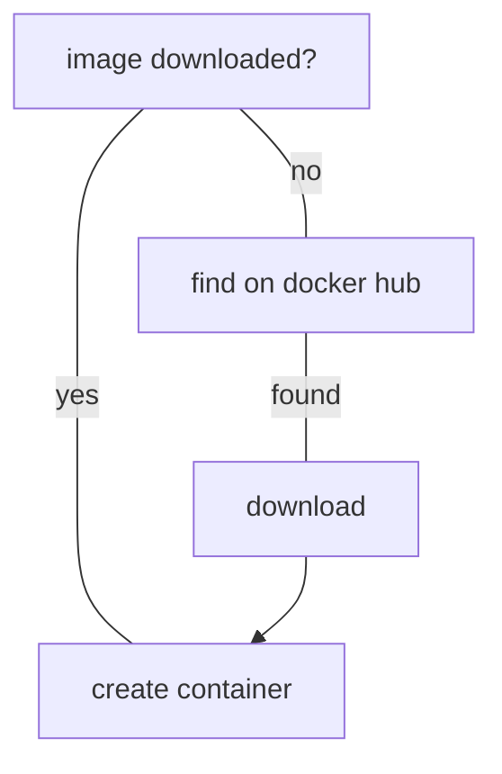
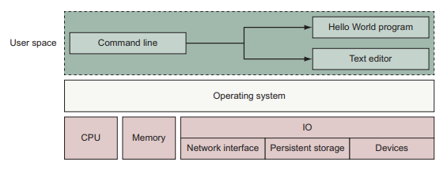
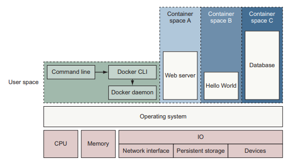

[TOC]

# welcome to docker

docker helps to adopt best practices easily and helps in distributions. docker containers is a better approach for testing and thus leads to higher production confidence.

docker run flow

> docker run dockerinaction/hello_world

the running state of container is tied to the state of a single running program inside the container, thus if a program died the container is destroyed. if we run `docker run` twice it actually creates *two* containers!

## docker and virtualization

docker might seems like virtualization at first glance, but its not. virtualization involves virtual hardware and creation requires significant resource overhead due to the entire operation system + software need to be run. VM provides hardware abstraction to run OS.

docker doesn't involves any hardware virtualization, programs running inside the containers (or runtime) interface directly with the host's kernel. many program can actually run in isolation without running redundant OS. containers are os feature.

thus in a way VM and containerization technology are not mutually exclusive but complimentary.

### some history

docker uses linux namespaces and cgroups which has been part of linux since many years ago. docker is not a new introduction of technology but simply makes container technology easier to be used. in normal use, in our user space (memory) or single CLI, we can run multiple softwares as shown below.

programs running in user space cant modify kernel space memory, which is the central part of an OS, and OS is the interface between programs and hardware.

run docker means running two programs in user space, docker engine which is something that should always be running and docker CLI which is what user interact with to start, stop or install software (images).

all three containers are *child processes* of the docker engine. they have their own memory and resources scoped by container.

### namespaces

system features that docker utilizes

- PID
- UTS - host and domain name
- MNT - filesystem access and structure
- IPC - communication over shared memory
- NET - network a and s
- USR - user names and id
- chroot syscall - fs root
- cgroups - resource proctection
- CAP drop - OS feature restrictions
- security modules - mandatory access controls

> production machines creates these containers with image provided

## what problem docker is trying to solve

OS, resources needed, dependencies, and more. also how do we ensure consistency across a server farm? yum, apt-get tries to solve this problem but does not provide **isolation**, eg we can have pg-10 and pg-11 both on same machine. docker abstracts us from worrying these problems, no manual configs needed. basically think pipenv.

portability between OS might be also a huge deal. basically it allows write once and run everywhere (sounds like java...). this also reduces discrepancies between different environment.

security reasons. if we runs a software on our computer, we are taking risk of security breach. but running processes / containers means risk is contained, the impact is limited due to the limited access of the program.

removal with docker is more deterministic compared to application removal. we can remove containers or images and everything is gone, since its the abstraction of the entire software.

## limitations

docker can only run applications that can run on linux OS, it cant run native mac or windows apps. still its a whole world of stuff can be run.

docker security is only as good as the access restriction it's given. if a container have full access to the machine then its still having the same risk of running a local installation. do not take security for granted.

## the bigger picture

container ochestration, HA clustering, microservice life cycle management and visibility.