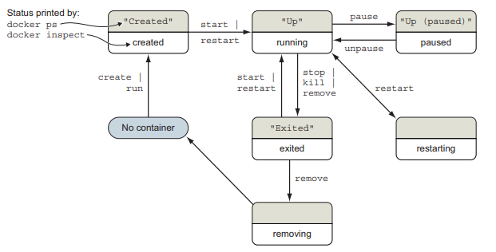

[TOC]

# running software in containers

keywords: detached, interactive, logs, reattach terminal, detach container

## starting a new container

1. detached containers

> docker run -d --name service_name image_name

we basically use docker to download or create images. background running program is also called `daemon` or `service`. they generally interacts with other programs over some communication channel.

2. interactive containers

> docker run --interactive --tty --link web:web --name service_name image name /bin/sh

*web is referring to the previous nginx container's name, also .bin/sh is the program we wanted to run in this case a UNIX shell, to exit the interactive container type exit*

## validating container

> docker ps

similar to ps -ax + ls

> docker restart service_name

similar to supervisorctl reload

> docker logs service_name

basically containerized app's stdout and stderr. but its not rotated nor truncated thus it will be growing indefinitely. more on this on chap03.

> docker stop service_name

...

## PID namespace

PID namespace is a set of unique number that identify processes. each namespace have its own set of possible PIDs, or each PID will have its own child PIDs.

> docker exec service_name ps

shows container's PIDs; its possible to share host PIDs using `--pid host` flag

with separated PID namespaces, we could start multiple nginx instance on a single machine (in difference containers). this resolves a lot of conflicts / collisions, from port, tmp filename, versioning etc.

### metaconflicts

when we start multiple instances of same instance container, if we use same name (`--name` flag is for human readable purposes) for multiple containers will cause docker to error out. thus for automation purposes, best is to use PID and `docker create` instead. also to avoid CID collision by keep a record of all CIDs, docker will smartly avoid it. docker does also generate human readable CIDs in a fun way.

## container state and dependencies

all possible states

## environment-agnostic systems

feature to help building env-agnostic systems

### read-only filesystems

the container created will always stay the same, and the provision admin can ensure no specialization between containers and attackers is blocked is some ways from compromising the container.

> docker inspect --format "{{.State.Running}}" service_name

inspect returns low level information of docker objects in json format; format flag using Go template

> docker diff service_name

check file or directory changes on container's filesystem

### environment variable injection

some images uses environment variables to configure dependent containers

> docker run --env ENV_VAR_NAME="val" service_name env

## long lasting containers

containers can only be in one of the six states stated above. by using the `--restart` flag we can configure the container behavior. docker don't just restart containers but it implements the exponential backoff strategy for each restart attempts. during the cooldown period, we cant do anything with the containers including `docker exec`.

to overcome that, we can use PID 1 and init systems. *init systems* is a program that use to launch and maintain the state of other programs, and any PID 1 program is treated like an init process by linux kernel. init process starts, restarts, transforms and forwards signals sent by system and prevent resource leaks. its common to use real init system inside containers when we will be running multiple processes. a few to name including supervisord, runit and tini.

an alternative to init systems is using a startup script to check preconditions for successfully start the contained software. docker containers runs a `entrypoint` before executing the command.

> docker run --entrypoint="cat" wordpress:5.0.0-php7.2-apache /usr/local/bin/docker-entrypoint.sh

*cat is the entrypoint and the docker-entrypoint.sh is teh supplement args*

running these startup scripts as PID1 can have some unwanted behavior if these scripts fails to meet the expectations of linux system has for init systems. thus depending on applications we might need to use either approach or hybrid.

## clean up

> docker rm service_name

...

> docker run nginx --rm

rm on exit state