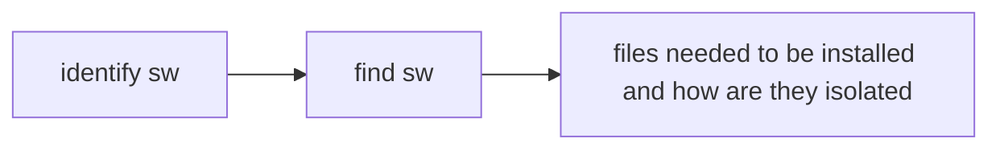

[TOC]

# software installation simplified

keywords: filesystems, software installation, layers, isolation

installing docker images

- docker registries
- images files with `docker save` and `docker load`
- building images with Dockerfiles

## identifying software

docker create containers from images, and image is a file. it holds files that will be available to the containers created from it and metadata about the image. these metadata contains labels, environment variables, default execution context, command history and more.

each image is globally unique identifiable, but its difficult for human users, instead we work with named repositories.

###  named repositories

a named bucket of images. similar to URL, its made up from the name of the host where the image is located, the user that owns it and a short name as shown

> docker.io/dockerinaction/ch3_hello_registry

there could be several images in a single repository and is identified with tags. a repository name and tag forms a composite key. in the example in chap01 its `nginx: latest`

### using tags

to uniquely identify images (versioning / feature tagging) and convenient way to create useful aliases. pay attention to tags offered in the repository as there usually exists multiple versions for different use cases.

## finding and installing software

dockerhub is a registry and index for web users run by docker Inc. its the default registry and index used by `docker` and is located at `docker.io`. when we run `docker run` or `docker pull` without specifying registry it look in dockerhub.

### dockerhub

image author can publish images to dockerhub or other registries through CLI or make the Dockerfile publicly available. most registries required authentication before publishing and enforce authorization checks on the updating repository.

### alternative registries

eg AWS or GCP offers private registries and using them is simple, no additional configuration is needed, all we need to do is to specify the address of registry as shown

> docker pull something/someone/some_project:latest or \[REGISTRYHOST:PORT/][USERNAME/]NAME[:TAG]

### working with images as files

> docker load -i filename.tar

on how to create an image file

1. pull an image
2. `docker save -o filename.tar imagename:latest`

note not always `.tar` for java it could be `.jar`.

### installing from Dockerfile

Dockerfile is a script describes steps for docker to build a new image. a common distribute pattern is to distribute with Git such that after cloning the repository we can build the image with `docker build -t projectname`. its less ideal as it depends on the spec of the project it might take a while and also dependencies may drift between publish date and build date.

## installation files and isolation

most of the time an image is not just a single file, its a collection of image layers. a layer is a set of files and file metadata that is packaged and distributed as an atomic unit. Docker treats each layer as an image and often called intermediate images. layers can be promoted to an image by tagging it. most layers build upon a parent layer by applying filesystem changes to the parent.

### layers in action

imagine dependencies as layers, if we dont have java-11 already then this java-11 layer will be pulled when we execute `docker pull some_image_that_need_java11:latest`. to check all images and layers (intermediate layers included) use `docker images -a`. `<none>` images can exists for a few reasons including building images without tagging it. check IMAGE ID for more clarity.

> docker image prune -y

### layer relationships

image retains parent-child relationship. layers are build from parents to form the child layer. a container is the union of all layers in the "lineage".

### container filesystem abstraction and isolation

programs running in a container knows nothing about the image layers, and inside the container the filesystem is just like any UNIX OS. from container perspective, is has copies of the file provided by the image. this is enabled by the union file system, MNT namespace, `chroot`, and more. filesystem is to abstract the use of layers. 

#### benefits

- common layers will only be downloaded and installed once (basically building forest with minimal tree nodes)
- managing dependencies and separating concerns
- create software specialization by layering minor changes on top of a basic image

#### downsides

- docker defaults is sensible but not perfect for every use case, different filesystems have different rules and union filesystems are in the position to translate rules between systems, we either get acceptable translation or a disaster (omitted features)
- implementing memory mapped files (`mmap` syscall) is difficult due to copy-on-write pattern is adopted
- default backing filesystem might not work and we need to specify by using `-s` flag and check with `info` subcommand