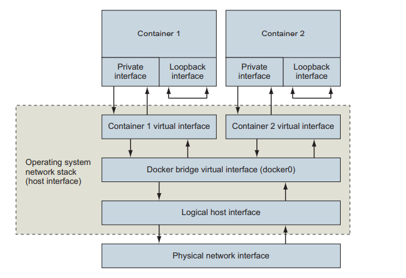

[TOC]

# single-host networking

keywords: networking, ingress network

## quick intro to networking

networking is the communication between processes that may or may not share the same resources.

### basics: protocols, interfaces, and ports

protocols is basically common ground where both parties agrees for effective communication and a ubiquitous example is HTTP. there exists a huge number of network protocols and several layers of communication created by these protocols.

interface is basically represents a location through an address or to be precise IP address defined by internet protocol. for a machine it has two interfaces ethernet interface and loopback interface. ethernet connect to other interfaces and processes and loopback interface isn't not connected to any interface, its used to communicate with other programs on the same machine using network protocols.

ports basically is the recipient or the sender, defined by UDP or TCP

### networks, NAT and port forwarding

there exists a recipient that exists in another, say machine where the sender interface have no direct connection to, which needs routing and relaying.

this chapter we discuss two networks including the one that host is connected to and the virtual network that docker creates to connect all running containers to the network that the host is connected to - namely bridge. bridge selectively forwarding traffic between connected networks based on some network address.

## docker container networking

docker network attachment is abstracted away from users. a container attached to docker network will get a unique IP address that is routable from other containers **attached to the same Docker network**. this also results that its difficult to obtain the IP address of the host for any software running inside the container (mitigation on subsequent subtopics).

docker treats network as first-class entities, where their have their own life cycles and not bounded by any other objects which can be managed directly through `docker network` subcommand.

docker includes 3 default networks provided by different driver. `bridge` provides inter-container connectivity for **all** containers running on the same machine. `host` instructs docker to not create special networking namespaces or resources for attached containers. containers on host network interact with host's network stack as if its not a container process. `null` attached containers doesn't have any network connectivity outside itself.

docker network scope ranges from local, global and swarm. local scope is constrained within same machine, global scoped network is created on every node in a cluster but does not route between them and swarm (multi-host / cluster wide) scoped network will seamlessly spans the network across all host that participates in the docker swarm. the **default bridge** doesn't support modern Docker features including service discovery and load balancing, its recommended to create a new bridge network.

### creating user-defined bridge network

docker bridge build on top of linux namespaces, virtual ethernet devices, and linux firewalls resulting in a specific and customizable virtual network topology. this resulting network is local to the machine and creates routes between participating containers and attached host network. each container is assigned a unique IP address which is not reachable from the external network. connection are routed through another Docker network that routes traffic between containers and connect to the host's network to form a bridge.

> docker network create --driver bridge --label project=dockerinaction --label something=something --attachable --scope local --subnet 10.0.42.0/24 --ip-range 10.0.42.128/25 user-network

`attachable` allows user to attach and detach containers to the network freely. subnet specified such that containers added to the network will be assigned IP address ranges between 10.0.42.128 to 10.0.42.255.