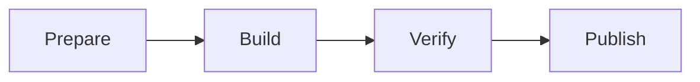
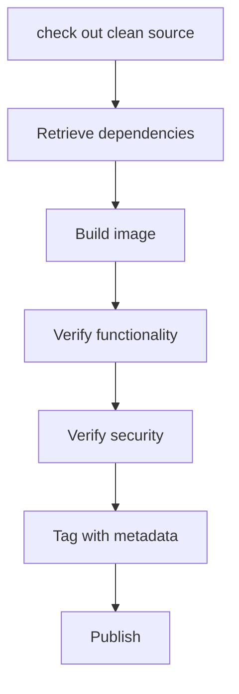

[TOC]

# image pipeline

keywords: pipeline patterns, testing, tagging patterns, publishing patterns

a pipeline automat the process mentioned above such that they can be deployed
to runtime environment. its similar to a CI pipeline. a more elaborate pipeline
is as shown below.

## image building patters

several patterns exists

- all in one
- build plus runtime
- build plus multiple runtime

### all in one

includes all the tools required to build and run the application, including SDK
, package managers, shared libraries, language specific tooling and other
binary. its easier to setup but also introduces more vulnerabilities to exploit
and are usually huge in size.

### build plus runtime

all build and test tooling will be included in one image and other will contain
only what the application requires at runtime.

### variations of runtime image via multi-stage builds

as our building experience matures, we might find it useful to create small
variations of an application image to support use cases such as debugging,
specialized testing or profiling. these can be achieved by using the
multi-stage build. regardless of stages, each build will only produce on image,
thus we can use `--target` flag to specify where to stop building and yield
desired image.

## record metadata at image build time

using `LABEL` instruction we can annotate image's metadata, minimum information
to capture including,

- application name
- application version
- build date and time
- version-control commit identifier

other information including Dockerfile and software package manifests are also
good to include in the image filesystem. check out [link](http://label-schema.org/)
for more.

### orchestrating build with make

make is a flexible shell like execution environment and help to construct a
dependency graph based on rules declared. in short using `make` to run docker
commands e.g. `build`, `run` and etc.