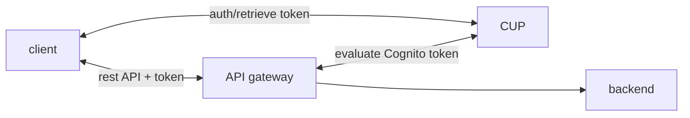
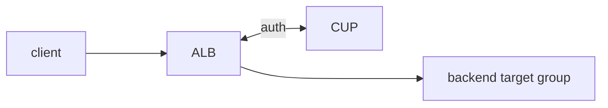
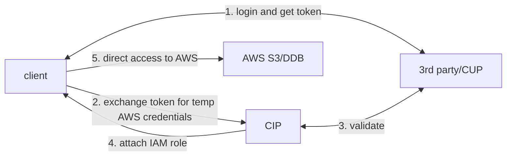

# IAM

Idendentity Access Management.

Root user creates users and groups. In AWS groups can only contain users, no
groups. Access in AWS is managed by policies and attaching them to IAM
identities or AWS resources. These policies defines permission and evaluated
when a request is made. Policies are usually in JSON format except access
control list. There are 6 types of policies

- identity based policies
- resource based policies: S3 bucket policies and IAM role policies
- permission boundary
- organization service control policy
- access control list
- session policies

Policies can be inherited from groups. Inline policies are for single IAM
entity (user, group, role) e.g. resource or IAM identity that is not in user
group. Inline policies are one to one binding and are deleted when entity is
deleted.

Policies can be build in IAM Policy Builder in the following policy structure,

```json
{
    "Version": "2012-10-17",
    "Statement": [
        {
            "Sid": "PermissionsBoundarySomeServices",
            "Effect": "Allow",
            "Action": [
                "cloudwatch:*",
                "dynamodb:*",
                "ec2:*",
                "s3:*"
            ],
            "Resource": "*"
        },
        {
            "Sid": "PermissionsBoundaryNoConfidentialBucket",
            "Effect": "Deny",
            "Action": "s3:*",
            "Resource": [
                "arn:aws:s3:::DOC-EXAMPLE-BUCKET1",
                "arn:aws:s3:::DOC-EXAMPLE-BUCKET1/*"
            ]
        }
    ]
}
```

Permission Boundaries

```json
{
    "Version": "2012-10-17",
    "Statement": [
        {
            "Effect": "Allow",
            "Action": [
                "s3:*",
                "cloudwatch:*",
                "ec2:*"
            ],
            "Resource": "*"
        }
    ]
}
// additional permission policy
{
  "Version": "2012-10-17",
  "Statement": {
    "Effect": "Allow",
    "Action": "iam:CreateUser",
    "Resource": "*"
  }
}
```

A user with additional permission policy will not be able to create iam user as
Permission boundaries superceeds the permission policy.

As for between resource based policy and identity based policy, AWS first looks
for explicit deny. If there is, its denied; If there isn't, AWS looks for an
explicit allow. As long as there is one allow, the request is allowed.

## Password Management

User password can be governed by enabling password policy that check for rules
including

- length
- characters requirements
- expiry
- password reuse

A general guideline for ASM are

1. only using root to create (super)users
2. one aws account per user
3. groups for access and permission
4. use password policy and MFA
5. assign appropriate roles for services
6. manage access key properly when using CLI/SDK i.e. not storing key on AWS console

## MFA

Multifactor authentication is possible and recommended in AWS in case of
password lost or hacked to prevent account compromise. Virtual MFA with

- google authenticator
- authy
- U2F security key

or hardware like keyfob MfA device and US goverment AWS govcloud keyfob.

## IAM roles

IAM roles are for AWS resources. This allows services to perform on behalf of
users. A few examples including EC2, lambda and ECS task.

## Security Tools

IAM credential report: account level list of all user and status of various
credentials e.g. password,, MFA status, access keys etc. to help in auditing
and compliance efforts (credentials lifecycle requirements)

IAM access advisor: user level list of service permission granted to user and
last used.

## AWS Cognito

Provide users an identity to interact with web or mobile application, these
users generally are outside of AWS account.

- Cognito User Pool (authentication)
  - sign in functionality for app users
  - integrate with API gateway and ALB
- Cognito Identity Pool (authorization)
  - provide temporary AWS credentials to users to access AWS resource directly
  - works with Cognito User Pool as an identity provider

### Cognito User Pool

Creates a serverless database of users for web and mobile app through simple
username/password login. It supports password reset, email/phone number
verification, MFA and federated identities from FB, Google, SAML etc.

API gateway



ALB



### Cognito Identity Pool

Provide AWS account identity for users ie. temporary AWS credentials. Users can
be from Cognito User Pool, 3rd party logins and etc. Users can then access AWS
services directly or through API gateway. The IAM policies applied to
credentials are defined in Cognito. The IAM policies can also be customized
based on `user_id` for fine grain control. A default IAM role can be defined
such that users (guest or authenticated) that dont have specific roles can
inherit from the default IAM role.



With Cognito Identity Pool, a row level security in DynamoDB can be setup such
that only if the leading key of DynamoDB is same as the cognito `user_id`, the
user can perform certain action.

## scratchpad

allow to impersonate? (whats the service/context)

billing info to set budge

general intro to region/AZ/POP etc
