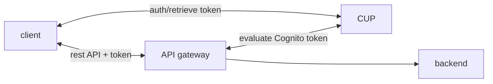
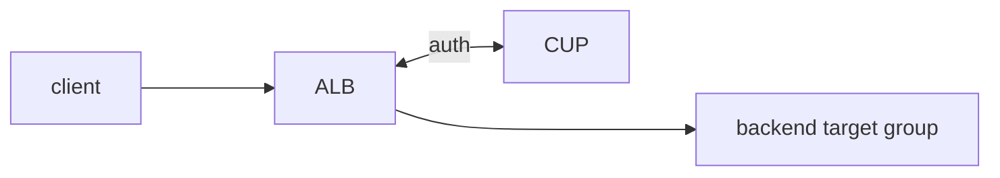
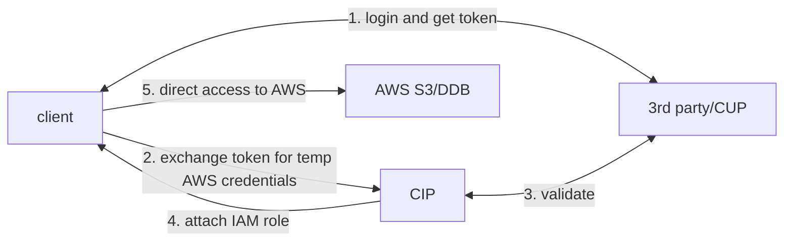

# IAM

> TODO seems unstructered

Idendentity Access Management.

Root user creates users and groups. In AWS groups can only contain users, no
groups. Access in AWS is managed by policies and attaching them to IAM
identities or AWS resources. These policies defines permission and evaluated
when a request is made. Policies are usually in JSON format except access
control list. There are 6 types of policies

- identity based policies
- resource based policies: S3 bucket policies and IAM role policies
- permission boundary
- organization service control policy
- access control list
- session policies

Policies can be inherited from groups. Inline policies are for single IAM
entity (user, group, role) e.g. resource or IAM identity that is not in user
group. Inline policies are one to one binding and are deleted when entity is
deleted.

Policies can be build in IAM Policy Builder in the following policy structure,

```json
{
    "Version": "2012-10-17",
    "Statement": [
        {
            "Sid": "PermissionsBoundarySomeServices",
            "Effect": "Allow",
            "Action": [
                "cloudwatch:*",
                "dynamodb:*",
                "ec2:*",
                "s3:*"
            ],
            "Resource": "*"
        },
        {
            "Sid": "PermissionsBoundaryNoConfidentialBucket",
            "Effect": "Deny",
            "Action": "s3:*",
            "Resource": [
                "arn:aws:s3:::DOC-EXAMPLE-BUCKET1",
                "arn:aws:s3:::DOC-EXAMPLE-BUCKET1/*"
            ]
        }
    ]
}
```

## Permission Boundaries

Supported for users and roles (not groups) to limit maximum permission an IAM
identity can get.

```json
{
    "Version": "2012-10-17",
    "Statement": [
        {
            "Effect": "Allow",
            "Action": [
                "s3:*",
                "cloudwatch:*",
                "ec2:*"
            ],
            "Resource": "*"
        }
    ]
}
// additional permission policy
{
  "Version": "2012-10-17",
  "Statement": {
    "Effect": "Allow",
    "Action": "iam:CreateUser",
    "Resource": "*"
  }
}
```

A user with additional permission policy will not be able to create iam user as
Permission boundaries superceeds the permission policy. It is usually used
together with Organization SCP.

As for between resource based policy and identity based policy, AWS first looks
for explicit deny. If there is, its denied; If there isn't, AWS looks for an
explicit allow. As long as there is one allow, the request is allowed.


## IAM conditions

```json
// aws:SourceIp -> restrict client from which the api call being made
{
  // ...
  "condition": {
    "NotIpAddress": {
      "aws:SourceIp": ["1.1.1.1", "2.2.2.2"]
    }
  }
}
// S3
{
  "Statement": [
    {
      "Effect": "Allow",
      "Action": ["s3:ListBucket"],
      "Resource": "arn:aws:s3:::test" // bucket level
    },
    {
      "Effect": "Allow",
      "Action": ["s3:PutObject", "s3:GetObject"],
      "Resource": "arn:aws:s3:::test/*" // object level
    }
  ]
}
```

- `aws:PrincipalOrgId` resource policy to restrict access to member of some org
- `ec2:ResourceTag/Project`
- `aws:PrincipalTag/Department`
- `aws:MultiFactorAuthPresent`
- `aws:RequestedRegion`

### IAM Roles vs Resource Based Policies

Assuming roles gives up existing role's access and only having assumed role's,
resource based policy does not require the principal to give up their
premissions. More AWS services allows resource based policy.

EventBridge is a unique services that requires both resource based policy and
IAM roles to interact with other AWS services. For now,

- resource based policy: SNS/SQS/CloudWatch Logs/API Gateway/Lambda
- IAM role: KDS/Systems Manager Run Command/ECS task

## Password Management

User password can be governed by enabling password policy that check for rules
including

- length
- characters requirements
- expiry
- password reuse

A general guideline for ASM are

1. only using root to create (super)users
2. one aws account per user
3. groups for access and permission
4. use password policy and MFA
5. assign appropriate roles for services
6. manage access key properly when using CLI/SDK i.e. not storing key on AWS console

## MFA

Multifactor authentication is possible and recommended in AWS in case of
password lost or hacked to prevent account compromise. Virtual MFA with

- google authenticator
- authy
- U2F security key

or hardware like keyfob MfA device and US goverment AWS govcloud keyfob.

## IAM roles

IAM roles are for AWS resources. This allows services to perform on behalf of
users. A few examples including EC2, lambda and ECS task.

## Security Tools

IAM credential report: account level list of all user and status of various
credentials e.g. password,, MFA status, access keys etc. to help in auditing
and compliance efforts (credentials lifecycle requirements)

IAM access advisor: user level list of service permission granted to user and
last used.

## AWS Cognito

Provide users an identity to interact with web or mobile application, these
users generally are outside of AWS account.

- Cognito User Pool (authentication)
  - sign in functionality for app users
  - integrate with API gateway and ALB
- Cognito Identity Pool (authorization)
  - provide temporary AWS credentials to users to access AWS resource directly
  - works with Cognito User Pool as an identity provider

### Cognito User Pool

Creates a serverless database of users for web and mobile app through simple
username/password login. It supports password reset, email/phone number
verification, MFA and federated identities from FB, Google, SAML etc.

API gateway



ALB



### Cognito Identity Pool

Provide AWS account identity for users ie. temporary AWS credentials. Users can
be from Cognito User Pool, 3rd party logins and etc. Users can then access AWS
services directly or through API gateway. The IAM policies applied to
credentials are defined in Cognito. The IAM policies can also be customized
based on `user_id` for fine grain control. A default IAM role can be defined
such that users (guest or authenticated) that dont have specific roles can
inherit from the default IAM role.



With Cognito Identity Pool, a row level security in DynamoDB can be setup such
that only if the leading key of DynamoDB is same as the cognito `user_id`, the
user can perform certain action.

## Organization

A global service to managed multiple AWS accounts. The main account is the
management account and others are member account. A single member account can
only be part of one organization. Organization allows billing to be
consolidated. Such single payment gives pricing benefits from aggregated usage.
Shared reserved instance and savings plan discounts are shared. AWS provides an
api to automate account creation.


Organization Units are commonly organized by business unit, environment
lifecycle or projects-based. Organization provides benefits such as

- multiple account as a separation vs single account multi VPC separation
- use tags for billing purposes
- enable CloudTrail on all accounts and log to central S3
- send CloudWatch to central logging account
- establish cross account role for admin purposes
- Service Control Policies (SCP) for security
  - IAM policy to apply on OU/accounts except mgmt to restrict users and roles
  - by default denies all access, requires explicit allow
  - OU deny but account allow still results in deny
  - allowlist and blocklist strategy
- backup policies - organization wide backup plan for compliance
- tag policies to standardize tags used on all resources

## AWS IAM Identity Center (was AWS SSO)

Single sign on service for all AWS accounts in AWS organization, business cloud
application (Salesforce, Box, Microsoft 365 etc), SAML2.0-enabled apps, EC2
Windows instances. Identity providers can be build in in IAM identity center or
3rd party e.g. AD, OngLogin, Okta...


How users linked to groups, to permisison sets and to specific accounts.


### Active Directory Setup

- AWS managed Microsoft AD
- self managed directory
  - create a two way trust relation using AWS managed Microsoft AD (ootb int.)
  - use AD connector

### Fine grouned permission and assignments

- Multi-account permissions
  - manage access across AWS accounts in Organization
  - permission sets is a collection of one or more IAM policies assigned to
    users and groups to define AWS access
- application assignments
  - sso access to SAML2.0 apps
  - provides urls, metadata and certificates
- attribtue based access control
  - permission based on user's attribute stored in IAM Identity Center ID Store
  - define permission once and modify AWS access through changing attributes

## AWS Directory Services

Microsoft AD is a service found on any Windows server with AD domain service.
It is a database of object including user accounts, computers, printers, file
shares, security groups and etc. Essentially it is a centralized security
management to create accounts and assigning permissions. These objects are
organized in trees and group of trees is a forest.

> one account for the named objects

AWS provides three types of AS services,

- AWS managed Microsoft AD
  - AD can be created in AWS to managed user locally and supports MFA
  - user can use AWS AD or on prem AD to authenticate (trust between on prem and AWS)
  - integration with AWS IAM Identity Center is out of the box (just connect)
- AD connector
  - AWS acts as a proxy to on prem AD and supports MFA
  - on prem AD managed users
- Simple AD
  - fully AWS managed, not joined with on-prem AD

## AWS Control Tower

Set up and govern a secure and compliant multi-account AWS environment using
AWS Organization to create account that is based on best practices. AWS Control
Tower offers guardrails to ensure compliance in two modes

- preventive: with AWS Organization's Sevice Control Policy
- detective: with AWS Config (fix non compliant with SSM or SNS to lambda)

With Control Tower, environment can be setup in few clicks and a monitoring
dashboard is provided.

## scratchpad

allow to impersonate? (whats the service/context)

billing info to set budge

general intro to region/AZ/POP etc
