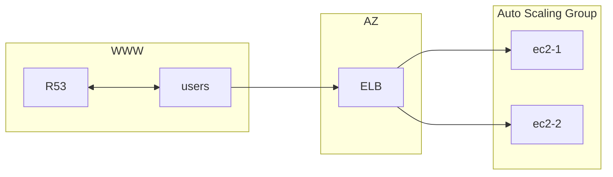
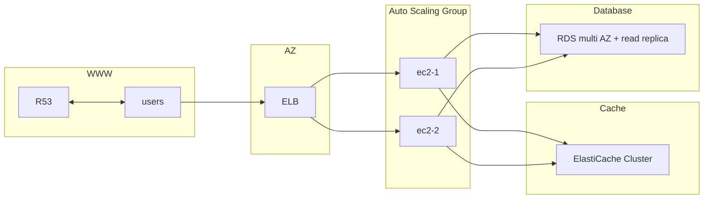
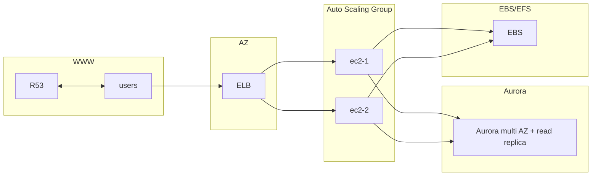

# Architecture

AWS EC2 instance are associated with emphemeral IPv4 IP address. To ensure
the IPv4 address always point to EC2 instance, elastic IP can be used (static),
5 per account. Using elastic IP are usually indicator of bad design, instead
use random public IP + DNS or load balancer with no public IP at all.

## Simple Web App

If ELB is used alias record is suitable, if user is directly hitting public
EC2 instance A record will do the job (with R53).

ASG can further improved by having multi AZ deployment -> high availability

Reserve capacity for cost optimization + on demand

### With Database

User information is stored in client browser with ELB sticky session. Note if
EC2 instance is terminated, the user session will be invalid.

Cache with ElastiCache for fast retrieval. For cache miss check RDS and update
to ElastiCache. ElastiCache can set TTL. ElastiCache alternatively can be used
as server side session. This is useful if user cookie is > 4kb.

alternatively,

EFS with multiple ENIs (bound to AZ, one per AZ). Similarly EBS works however
with a catch that its also bounded to AZ and connecting to instance might not
return data from another EBS. EBS is not suitable for distributed system.

### Quick Launch

Snapshot can allow quick restore of RDS and EBS.

## Elastic BeanStalk

Orchestration service by AWS that allow AWS components to be reused e.g. the
architecture above (R53, ELB and ASG). It manages capacity provisioning, load
balancing, scaling, health monitoring, instance configuration etc. Develop will
only need to focus on application code. The orchestration is still
configurable.

There is two deployment mode, single instance for developmet (with elastic IP)
and high availability with load balancer for prod.

BeanStalk is made up of 3 components,

- application: collection of BeanStalk components (envs, versions, configs,...)
- applicaiton version
- environment(s)
  - collection of AWS resource (only one application at a time)
  - tiers (web/worker)

BeanStalk deployment is done by CloudFormation.
