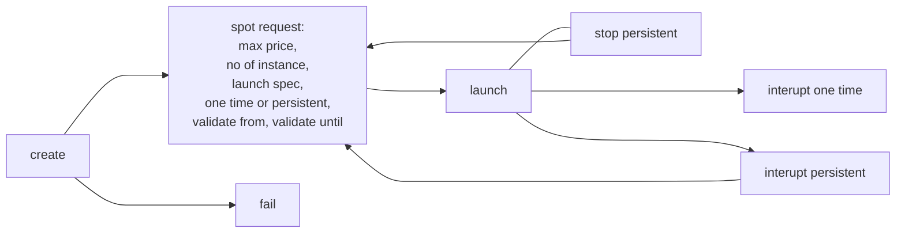
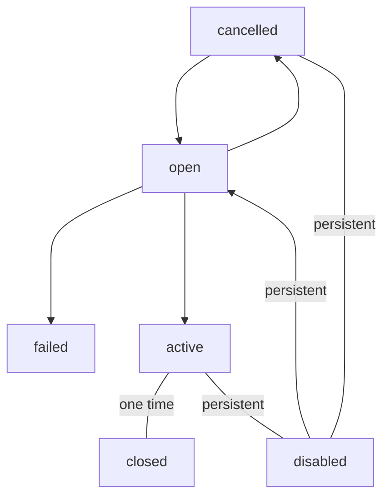

# Compute Services

## EC2

Virtual machines for rent with full customization on OS, cpu, ram, network
options, firewall rules and security groups.

EC2 allows user to define boostrap script known as "EC2 user data" to run at
instance launch that runs as `root` user.

### EC2 lifecycle

- launch
- stop (hibernate): instance state is kept and no billing
- terminate

When started, the OS boots and runs EC2 user data if any. Subsequently any
user defined application is launched together with cache warm up. In stop 
state, EC2 instance's data on disk is persisted until the next start.
Terminating EC2 will results in destroying the root volume. In order for
speeding up boot hibernation can be utilized. The ram's state is perserved
which results in not required to boot OS. This is done by writing the ram state
into a file in the root EBS volume, as long as it is large enough and is
encrypted. This helps to resume long running processes with/and critical ram
state application through fast booting.

Relaunch a stopped instance will results in change of external IP address.

EC2 instance naming is intepreted as
`{instance class}{generation}.{size within instance class}` e.g. `M2.2xLarge`.

### Instance Classes

- general purposes (`T*`)
  - code repo, web app
- compute optimized (`C*`)
  - batch processing, media transcodeing, HP web/HPC, modeling/ML, gamming
- memory optimized (`R*`)
  - HP database, cache, in memory database, real time processing unstructured data
- storage optimized
  - low latency, high IOPS local storage read/write access
  - OLTP, SQL/noSQL, in memory database, data warehouse app, distributed file system

### Purchasing Options

| name | short description | discount | cost | upfront payment |
|-|-|-|-|-|
| on demand | uninterupted short workload, predicted pricing by second | NA | highest | NA |
| reserved (1/3 years) | reserves instance by attribute (os, type, region etc), convertible option for flexible instances, can be regional or zonal | ~72% or ~66% for convertible | yes |
| savings plan (1/3 years) | commitment for usage e.g. $10/hour not instance type, exceeding is billed as on demand | ~72% savings | | no/partial/all upfront for various discounts |
| spot instance | short workload, emphemeral | ~90% |
| dedicated host | book entire physical server and placement, for compliance or server bound license | | highest, can be on demand or reserved |
| dedicated instance | not sharing hardware with others, may share hardware with other instance of same account, no control over placement |
| capacity reservation | reserve capacity in AZ and get charges regardless | on demand |

#### spot instance/fleet

Define a max spot price, a target capacity (instance, vCPU, ram) and per
instance attributes, get instance when current price is less than defined max
spot price. Instance is terminated or stopped when price is greater than
defined max spot price with 2 minute grace period.

spot instance request lifecycle

spot instance lifecycle

> validate from/until can be infinite

Spot instance can only be terminated in `open`, `active`, `disable` state. User
should first cancel spot request before terminating the instance else new
instance will be created (cancelling spot request does not terminate instance).

Spot fleet: getting set of spot instance + optional on demend instances. It
tries to meet target capacity with price constraints. It launch the most
appropriate defined launch pool (can have multiple). It stop launch if max
cost or capacity is met.

Spot fleet allocation strategy

- lowest price: from all pool
- diversified: distributed from all pools (good for availability)
- capacity optimized: poll with optimal capacity for number of instances
- price capacity optimized: pool with highest capacity and then lowest price

(deprecated) spot block to get reserved 1-6 hours without interruptions.

### Security Group

Controls inbound/outbound traffic in EC2 with only allow rules. Can be
reference by IP (IPv4/v6) or another security group. Think if of as a port
firewall (UFW). Inbound/outbound rules are edited separately. Security group
can be one to many (resource) and limited to same VPC/peered VPC in same
region. Security group are statefull, a traffic once allowed inbound/outbound
is allowed on outbound/inbound.

> when troubleshooting, timeout are usually good indicators of incorrect setup.

### Placement Groups

- cluster: cluster instance into low latency group in single AZ (high network throughput on same rack, high risk of catastrophic failure)
- spread: spread instances across underlying hardware (max 7 per AZ) for HA
- partition: spread instances across many partitions (racks) within AZ, up to hundreds of EC2 per group and up to 7 partion in AZ

# Amazon Machine Image (AMI)

Customized EC2 instance including software, OS, config, monitoring etc. for
fast boot/config time through prepackaging. AMI are bounded by region, and can
be copied across region. AWS marketplace can find AMIs for sale.

To create AMI first start EC2 instance in desired config and install desired
software. Stop the instance and build AMI by choosing `create image`.

## Application Scalability

Allow application to handle greater traffic by adapting through vertical and
horrizontal/elastic scaling. Scaling is related but not exactly high
availability. Vertical scaling examples including better spec, use of caching
and etc non-distributed approach. Horrizontal scaling examples including adding
more machines, running in distributed fashion with auto scaling group and load
balancer.

High availability implies running application in more than 1 data center/AZ.
HA can be active with horizontal scaling or passive with RDS multi AZ. Examples
like auto scaling group/load balancer in multi AZ.

> check [elastic load balancer](./network.md/#elastic-load-balancer-elb)

### Auto Scaling Group (ASG)

Scales in/out depending on traffic by ensuring minimum/maximum instances
running. ASG registers new instance with load balancer. ASG will try to
recreate EC2 instance that marked unhealty and gets termination signal from
ELB.

A launch template is requires for ASG to work with the following informations,

- AMI + instance type
- EC2 user data
- EBS volume
- security groups
- ssh key pairs
- scaling policy
- IAM roles
- network/subnet information
- load balancer information
- min/max capacity and initial capacity

Besides ELB, ASG can scale based on CloudWatch Alarms e.g. average CPU. The
metric is computed for overall ASG instance.

#### Scaling Policies

- dynamic scaling
  - target tracking scaling: ASG average cpu
  - simple/step scaling: CloudWatch alarm trigger and add/remove X units
  - scheduled action: anticipate traffic 11/11 etc
- pretictive scaling
  - continuous forecast and schedule ahead

In the scaling policy there is a scaling cooldown that default to  300s to
prevent scaling after scaling process completed

## MISC

ports to remember

| name | port number |
|-|-|
| ssh/sftp | 22 |
| ftp | 21 |
| http | 80 |
| https | 443 |
| rdp | 3389 |