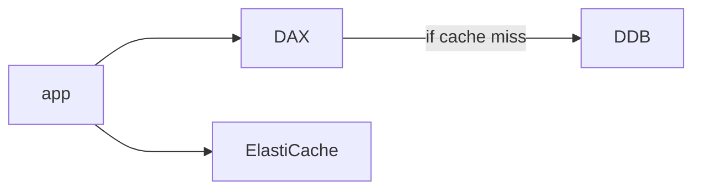
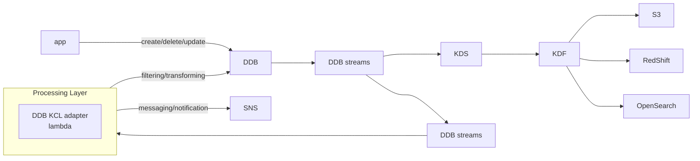

# database

## Relational Database

### Relational Database Service (RDS)

AWS managed (patch, maintenance, continuous backup, point in time restore).
Supports MySQL/MariaDB, Postgresql, Microsoft SQL, Oracle, Aurora and custom
option. RDS provides a monitoring dashboard, read replica, multi AZ deployment
for disaster recovery. RDS can be scaled both vertically and horizontally.
RDS's is build on top of EBS (gp2 or io). For managed instance, SSH is not
allowed. RDS's maintenance will results in some downtime.

> provisioned RDS instance size and EBS volume type/size to be specified.

Auto scaling of RDS can be setup such that the storage increase dynamically by
setting a maximum storage threshold e.g. free storage is < 10% of provisioned
storage. Auto scaling is suitable for unpredictable workloads.

Custom RDS option is only for Oracle and MySQL. They are same tto the non
custom option with additional ability to choose OS and SSH to machine.

#### RDS read replica and Multi AZ

Read replica is an async operation that is able to scale read up to 15 instance
across AZ or within same AZ or across region (note cross region is chargeable).
Async nature results in the read replicas are eventual consistent. These
replicas can be promoted into their own. Connection string will be different
for the replicas. Backup are not configure by default.

Multi AZ option is a sync operation meant for disaster recovery by using a
single DNS name for failover (one connection string). Such active backup
increases the availability. Failover happens when there is a network issue,
or AZ loss or instance/storage failure without manual intervention. Note that
there is no read/write capacity improvement, the backup will only come online
when a failover happens.

> multi AZ availability option allows to have 1 or 2 standby DB instance, named
> multi AZ instance deployment and multi AZ cluster deployment. The latter can
> serve read traffic.

A combination of read replica and multi AZ can be used to gether to have a 1 +
1 (backup) + 15 read replica RDS cluster. A multi region deployment read
replica is used as failover **????

It is possible for RDS to be promoted from single AZ to multi AZ with no
downtime by modifying the database option. RDS will take a snapshot of database
and restore it in a new AZ and run a sync between two instance.

#### RDS Event Notification

RDS event notification broadcast information about the database instance i.e.
database created, stopped, started etc and not about the data itself. These
events can be subscribed with downstream SNS or EventBridge and receive near
real time events (up to 5 minutes).

#### RDS (& Aurora) Lambda Integration

Lambda function can be invoked by the database instance to process data events
e.g. data inserted etc. This is supported for RDS pg and Aurora MySQL. Proper
outbound traffic to lambda function from database instance (Public, NAT, VPC
endpoints) and IAM permission/lambda resource based policy must be setup.

#### RDS Proxy

Fully managed database proxy for RDS to allow pooled connection to database.
Good use case when having thousands of lambda functions. It improves the
database efficiency by reducing stress on database resource and minimized
open connections. RDS proxy is able to auto scale and is high available through
multiple AZ. It improved the failover time ~66%. Supports RDS and Aurora. It
enforces IAM authentication and credentials are stored in AWS Secrets Manager.
RDS proxy is never publicly acccessible, traffic must be from VPC.

#### Aurora

> separation of storage and compute

Database compatible to postgres and mysql that is cloud optimized (generally
better than their RDS counterpart). Auto scales storage in increments of 10 -
128 GB with scaling policy. Can have up to 15 read replicas with ~10ms of
replica lag. The read replica can be promoted as master and read replica can be
in different region. Supports failover and is natively high available at the
cost of +20% cost of RDS. Patching are done automatically with zero downtime.

By default an aurora cluster create 6 copies of data across 3 AZ. 4 out of 6
copies are needed for write and 3 out of 6 for reads. Aurora has self healing
capabilities through peer to peer replication. The data is stored in hundreds
of volumnes.

Aurora provides a writer endpoint DNS for master and a reader endpoint DNS with
connection load balancer. Custom endpoints can be created for different use
cases e.g. OLAP etc. When custom endpoints is used, the default reader endpoint
should not be used. With custom enpoints that is meant for OLAP more powerful
machine can be used.

Aurora's replica auto scaling can be done through metric monitoring e.g. cpu
usage and creates more read replica under the same reader endpoint.

Aurora has a serverless option that scales based on actual usage meant for
unpredictable usage. It is a pay per second cost model.

Aurora machine learning integration allows user to make ML based prediction
with sql-like query through integration with SageMaker and Comprehend. Use
cases including fraud detection, recommendations, sentiment analysis and etc.

##### Aurora Global Database

Aurora global database is a service that have 1 primary region for (read/write)
and up to 5 read only region with ~1s replication lag. For each region up to 16
read replica is possible. Promoting another region for disaster recovery has an
RTO of < 1 minute.

> Aurora cross region replication and Aurora global database's difference is
> Aurora global database uses physical level replication while the prior uses
> logical level replication.

##### Aurora Database Clonning

Creates a new one from the existing one for testing/development purposes. Uses
a copy on write protocol which results in no copy until updates are made to the
new database cluster. Storage is only then allocated and data is copied. This
allows clonning to be fast and cost effective. It is also faster than restoring
a snapshot.

#### Backup For RDS And Aurora

| - | RDS | Aurora |
|-|-|-|
| auto backup (1 - 35 days) | daily backup during backup window, transaction log every 5 minute | cannot be disabled |
| PITR recovery | Y | Y |
| manual snapshot (retain as long as possible) | Y | Y |

A trick to save cost on RDS is to create snapshot and delete database if usage
is 0 for some time. RDS charges as long as instance are up.

Restoring snapshots creates a new database. Backup can be created for on prem
database and restore to cloud through S3. Note that for Aurora cluster, Percona
XtraBackup is needed.

#### Security For RDS And Aurora

At rest, data are encrypted using KMS (defined during creation time). If master
is not encrypted, replication will not be encrypted. To encrypt unencrypted
database, snapshot and restore (EBS).

At flight TLS is ready and uses AWS TLS root certificate.

IAM authentication is available and IAM roles can be defined. Security group
can help to filter unwanted connections and audit log can be enabled to send to
CloudWatch.

## NoSQL

### DynamoDB

Fully managed (severless), HA with replication across multi-AZ NoSQL service
with transaction support. It is internally distributed thus it scales to
massive workloads. It can handle millions or request per second, have trillions
of rows, and have hundreds of TB of storage. It is fast and consistent in
performance (single digit ms). It integrates well with IAM. DynamoDB is low
cost and have auto scaling capabilities. It is always available and have
standard and infrequent access table class.

DynamoDB is made of Tables. Each table has a primary key and must be decided at
creation time. Each table can have infinite rows/items and each item has
attributes (columns) that can be added over time or be null. There is a 400kb
limit for item size. Data types supported are

- scalar type: string, number, binary, boolean null
- document type: list, map
- set type: string set, number set, binary set

> it is great for rapidly evolving schemas

The primary key is made of a partition key and sort key (optional).

Provisioned Mode:

- specify read/write per second (read/write capacity unit)
- pay for provisioned RCU/WCU
- possible to add ASG for RCU and WCU (auto-scaling option?)

On-Demand Mode:

- read/write automatically scale up/down with workload
- no capacity planning
- pay per use and is much expensive
- good for unpredictable workload

> keyword: ever evolving schema

DynamoDB has a TTL feature which delete items that expires from the timestamp.
TTL is an attribute in epoch time format and it is usually used for keeping
track of must recent version or for regulatory obligation or web session
handling.

#### DynamoDB Accelerator (DAX)

Fully managed, HA, seamless in memory cache for DynamoDB. It address read
congestion by caching and allows microseconds latency for cached data. No
application logic modification needed (compatible to Dynamodb APIs). Default
TTL of 5 minutes.

DAX is good for individual object cache or database scan and query while
ElastiCache is good for aggregated results (computation intensive ). DAX and
Elasticache is complimentary instead of competition.

#### DynamoDB Stream Processing

Ordered stream of item level modification (create/delete/update) in table for

- real time reaction (welcome email)
- real time usage analytics
- insert to derivate tables
- implement cross region replication
- invoke AWS lambda to make changes

| DynamoDB Streams | Kinesis Data Streams |
|-|-|
| 24 hour retention | 1 year retention |
| limited number of consumers | high number of consumers |
| lambda, DynamoDB Stream Kinesis Adapter | lambda, KDA, KDF, Glue streaming ETL |

#### DynamoDB Global Tables

A two way replication of multi region table such that it is accessible with low
latency at multiple regions. It is an active-active replication such that
application can read and write to the table from any region. DynamoDB global
table's underlaying replication is based on DynamoDB stream processing (to be
enabled).

#### DynamoDB Backup for Disaster Recovery

Recovery always creates a new table.

- continuous backup for PITR
  - optional up to 35 days
- on demand backup
  - full backup for long term retention i.e. explicit delete
  - does not affect performance/latency
  - can be configured and manage in AWS backup (lifecycle policy, cross region copy etc)

#### DynamoDB S3 Integration

- export to S3
  - with PITR enabled, DynamoDB can be exported to S3 (for Athena query)
  - does not affect read/write capacity (for analytics)
  - retain snapshot for audit purpose
  - ETL on top of S3 before importing back to DynamoDB
  - in JSON format or ION format
- import from S3
  - import CSV, DynamoDB JSON or ION format
  - does not consume write capacity
  - creates a new table
  - import errors are available in CloudWatch logs

### DocumentDB

DocumentDB is the managed/AWS-implemented MongoDB. It has similar deployment
concepts as Aurora, i.e. HA with replication across 3AZ. It stores, queries and
indexes JSON data. Its storage automatically grows in increments of 10GB. It
scales to workloads with millions of request per seconds.

## Amazon Keyspaces (for Apache Cassandra)

Managed Apache Cassandra compatible distributed NoSQL database service. It will
be able to scale table up and down based on application traffic. Tables are
replicated 3 times across multiple AZ and uses CQL (Cassandra Query Language).
Provides single digit ms latancy at any scale, thousands of request per second.
Similar to DDB, there are two capacity modes

- on demand mode
- provisioned mode with auto scaling

Encryption, backup (PITR up to 35 days) are also options provided. It is
commonly used for storing IoT device information, time series data and etc.

## Amazon Neptune

Fully managed graph database (think social network as the graph dataset). HA
across 3 AZ with up to 15 read replicas. Build and run application with highly
connected datasets (optimized for complex and hard queries). Stores billions of
relations and query graph within ms range latency. Other use cases including
storing knowledge graphs (Wikipedia), fraud detection, recsys and etc.

## Amazon QLDB

Quantum ledger database to record financial transactions. It is fully managed,
serverless, HA, have replication across 3 AZ. It is used to review history of
all changes made to application data over time. It is immutable such that no
entry can be removed or deleted and it is cryptogrphically verifiable. 2-3
times better performance than common blockchain ledger frameworks and allows
user to manipulate date with SQL.

> difference from Amazon Managed Blockchain is that there is QLDB has no
> concept of decentralization, it is a centralized database owned by AWS and is
> in accordance with financial regulation rules.

## Amazon Timestream

Fully managed, fast, scalable, serverless time series database. It
automatically scales up and down based on capacity. Is can store and analyze
trillions of events per day. It is 1000s faster and cost 1/10 of relational
databases. The data storage is tiered such that recent data is in memory and
historical data is in cost optimized storage. It is build in with time series
analysis functions (near real time performance) and is able to run scheduled
queries, multi-measure records and is SQL compatible. Data stored are encrypted
in transit and at rest.

> uses cases including IoT apps, operational apps, real time analytics and etc.

Upstream compatibility

- AWS IoT
- KDS/lambda
- AWS MSK

Downstream compatibility

- Amazon QuickSight
- Amazon SageMaker
- Grafana
- any JDBC connection

## ElastiCache

Managed redis and memcached that gives high performance and low latency
(submiliseconds). Helps to reduce load on database and makes application
stateless (potentially balance the EC2 instances). Supports cache invalidation
strategy for data update.

> managed and scheduled maintenance

| feature | Redis | Memcached |
|-|-|-|
| multi AZ | Y | N |
| read replica (scale read/HA) | Y | N |
| data durability (AOF)/ persistent | Y | N |
| backup and restore | Y | N |
| supports sets and sorted sets | Y | N |
| multi node partition/sharing | N | Y |
| multi threaded | N | Y |

### ElastiCache Security

| feature | Redis | Memcached |
|-|-|-|
| IAM Authentication | Y | N |
| IAM policy (AWS api level security) | Y | Y |
| user/pw | Y (redis AUTH) | ? |
| security group | Y | Y |
| SSL in flight | Y | Y |
| SASL | N | Y |
| KMS encryption at rest (option) | Y | Y |
| default service managed encryption at rest | Y | Y |

### Patterns For ElastiCache

> application code changes is required

- lazy loading: all read to cache (stale cache and cache invalidation)
- write-through: add/update data in cache when updated to database (no stale)
- session store: store user session (TTL)

Special use case of Redis - gaming dashboard using sorted sets to track real
time top-1. Redis sorted set guarantee uniqueness and ordering.

## nosql vs sql

SQL supports join, sql query statements.

## aurora vs rds

- aurora manages more (spin up and go with preset)
- aurora handles load better
- rds more configs
- rds on ssd

## Choosing the right database

- read/write heavy? balanced workload? throughput need?
  - stable/dynamic workload
- how much data, for how long? is it growing? average object size?
  - how are they accessed?
- data durability? source of truth for data?
- latency requirements? concurrent users?
- data model? how data is queried? joined? structured? semi structured?
- strong schema? flexibility? reporting? search? rdbms/nosql?
- license cost? cloud native aurora?

## Database Migration Service

A quick and secure database migration to AWS service which is also resilient
and have have self healing capabilities. Source database will be available
during the migration. The service supports

- homogeneous migration e.g oracle to oracle
- heterogeneous migration e.g. mssql to Aurora

It supports continuous data replication with change data capture (CDC). DMS
replies user to create an EC2 instance to perform replication tasks. AWS offers
a Schema Convertion Tool (SCT) in case the target and source database are using
different engine. DMS has a multi-AZ deployment option to provision and
maintain a synchronous stand replica in a different AZ. This has the advantage
of having redundancy, eliminates I/O freeze and minimize latency spikes.

> covers on prem to cloud, cloud to cloud and cloud to on prem

### On prem or RDS to Aurora Migration

- RDS to Aurora
  - DB snapshot from RDS to restore as Aurora
    - with downtime i.e. stop RDS -> backup -> restore
  - create Aurora read replica from RDS and wait for replication lag to be 0
    - takes time and cost $
- external to Aurora
  - mysql
    - Percona XtraBackup to S3 and create Aurora from S3
    - create Aurora DB and use `mysqldump` utility (slower than S3)
  - pg
    - create backup and send to S3 then import using `aws_s3` Aurora extension

> use DMS if both database are up and running

## MISC

| database | port |
|-|-|
| pg | 5432 |
| oracle | 1521 |
| mysql/mariadb | 3306 |
| mssql | 1433 |