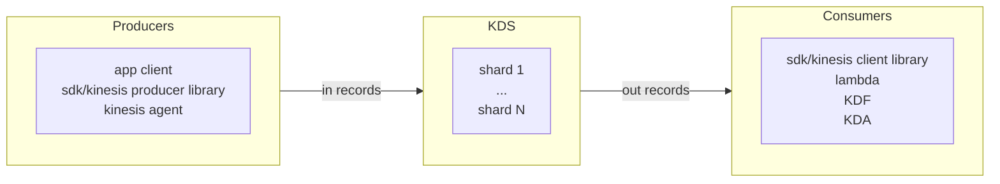
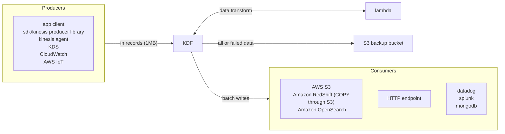

# Middlewares

## Simple Queue System

Fully managed queue where producer connects with SDK or `sendMessage` api and
consumers poll the queue, process and delete the message (up to 10 at a time).
SQS has unlimited throughput and there is no limit of number of messages. Each
message has default of 4 days retention (if not processed/deleted) and maximum
up to 14 days. SQS has low latency < 10ms on each message's publish and
receive. It limits each message to be < 256kb. SQS guarantees at least once
delivery (duplicated message can be received by multiple consumers) and have
best effort message ordering.

Scaling can be done with ASG using CloudWatch on metrics e.g.
`approximate number of messages`. Provides encryption through HTTPS, and KMS
for data at rest. Also client side encryption is optional. Access control is
possible through IAM and SQS access policy for cross account and other AWS
services.

Consumers can choose to have a long polling connection to SQS to wait for a new
message. Such approach reduces latency and reduce poll count. This can be set
at queue level or at api level (consumer). Generally its between 1-20 seconds.

FIFO queue is available that guarantees message ordering but has a limited
throughput of 300 messages/s without batching and 3000 msg/s with batching. It
also guarantees exact once delivery by removing duplicates. SQS FIFO queue has
a message group features such that each consumer can request for a batch of
messages within the same message queue to be processed.

SQS can be used a buffers to database write when the traffic is high. It helps
decoupling the write operation to database from the application request.

> retries is possible with SQS i.e. when a message is not processed, it will be
> visible once the visibility has timeout to other consumers.

### Message Visibility

SQS at least once delivery is implemented using message visibility timeout.
When a message is polled, it is invisible to other consumers for some time (30s
default). It is possible for consumers to request extension of visibility
timeout through the change message visibility api if additional processing time
is required.

If visibility timeout is set for a large number, the reprocess of message will
be delayed if the consumer is crashed.

### Dead Letter Queue

Queue for messages that failed to be consumed successfully. Useful for
debugging. Configure maximum receives before sending to DLQ to a value between
1 and 1000.

## Simple Notification System

Fully managed pub/sub model where there is one producer and many consumers.
These consumer uses the messages differently (e.g. email, write to database
etc). With SNS, they will receive all the messages (optional filtering). Up to
12.5Mil subscription per topic and 100k topic limit per SNS. Security details
is same as SQS. SNS has a FIFO feature similar to SQS FIFO with same
throughput. Filtering is done through specifying a JSON policy, by default if a
subscription has no filtering policy it receives all messages.

SNS can be published to SQS, lambda, KDF, email/mobile notification, and HTTP
endpoints. Publishing into SNS can be done with topic publish through SDK by
creating a topic, creating a subscription and publish to topic. Alternatively,
mobile apps SDK can do a direct publish by creating a platform application and
endpoint, publish to platform endpoint (works with google GCM, apple APNS and
amazon ADM).

> SNS does not persist message, they are deleted once delivered

### Fanout Pattern with SNS and SQS

A single SNS topic is subscribed by multiple SQS queues such that once message
is pulished to SNS, the queues can process the messages. Appropriate policies
required to be in place. Such setup can be across region. Similarly, this
pattern can be applied to SNS + KDF or SNS FIFO + SQS FIFO (for fanout +
ordering + deduplication).

## Kinesis

AWS Kinesis is a suite of service for collect, process and analyze streaming
data in real time.

### Kinesis Data Stream

> Number of shards is defined and provisioned ahead of time that serves as
> stream capacity.

For each incoming records there is a partition key and data blob up to 1MB at
1MB/s or 1000 message/s per shard. For each outgoing records there is a
partition key, sequence number and data blob. The outgoing records can be
consumed at 2MB/s per shard for all consumers or 2MB/s per shard per consumer
(enchanced/push data).

KDS is a real time regional level streaming service with retention of 1-365
days. It has the ability to replay and is immutable (once inserted and cant be
deleted). All data that shares the same partition goes to the same shard
(ordering).

- provisioned capacity mode
  - specify number of shards, scale manually or through api
  - each shards gets 1MB/s in and 2MB/s out
  - pay per shard per hour
- on demand capacity mode
  - no capacity management, scales automatically based on historic throughput peak
  - default provisioned 4MB/s in or 4000 records per second
  - pay per stream per hour and data in/out per GB

Security is managed through IAM authorization/access control, HTTPS in flight
encryption, KMS at rest encryption, client side encryption is possible, VPC
endpoints available to access within VPC and monitoring through CloudTrail.

### Kinesis Data Firehose

Fully managed auto scaling serverless ingestion service. Pay as data going
through firehose pricing model. It is near real time (60s latency minimum for
non full batches or minimum 1MB of data at a time). Good support for many data
formats, conversion/transformation/compression. Custom transformation with
lambda is also possible.

## Kinesis, SQS and SNS

Ordering in kinesis is preserved at shard level, thus ensuring that all logical
group are send to a single shard will result in ordered data. Ordering for SQS
FIFO is at queue level with one consumer or at message group level.

SQS and SNS has a maximum message size of 256kb while KDS has a maximum size of
1MB.

## Amazon MQ

SNS/SQS are proprietary cloud native protocol from AWS. Open source protocols
e.g. MQTT, AMQP, STOMP, Openwire and WSS can use Amazon MQ instead without
re-engineering the applications. It is a managed message broker for RabbitMQ
and ActiveMQ. The scalability is not as good as SQS/SNS however is still
possible to run in multi-AZ with failover. Offers queue and topic feature.
