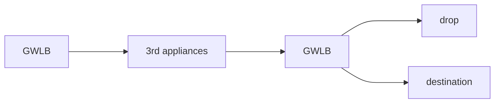
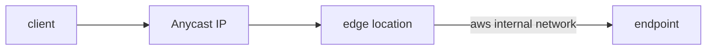

# Network

## Elastic Network Interface

A logical component in VPC that represets a virtual network card. It allows

- 1 primary IPv4, 1 or more secondary IPv4
- 1 elastic IP or 1 public IP per private IP
- 1 or more security groups
- provide mac address
- bound to AZ

```
eth0: flags=4099<UP,BROADCAST,MULTICAST>  mtu 1500 (primary ENI)
    some IPv4 address
eth1: flags=4099<UP,BROADCAST,MULTICAST>  mtu 1500 (secondary ENI)
    some IPv4 address
```

> note above is not accurate and only meant for giving an example

ENI can be create independently and connected to instance on the fly. It can be
used as network failover. Manual created ENI persist when instance is
terminated.

## Elastic Load Balancer (ELB)

A load balancer acts as a single point of access through static DNS  and
forwards traffic to instances to spread load, have seamless failure handling of
downstream instance. ELB is able to do health check, ssl termination, enforce
stickiness with cookies. It is high available across AZ and separates public
traffic from private traffic. ELB is managed by AWS with few tuning knobs.
Upgrades, maintenence are all done behind the scene. ELB integrates well with
other AWS services. ELB healthcheck is done by checking on a port and route to
decide if traffic is forwarded.

- CLB: HTTP, HTTPS, TCP, TLS/SSL (secured TCP)
- ALB: HTTP, HTTPS, websocket
- NLB: TCP, TLS, UDP
- GWLB: operates at OSI L3 IP protocol

EC2's security group should be used as ELB's security group such that ELB's
accepts all EC2's incoming traffic.

### Application Load Balancer (ALB)

Is a L7 load balancer that supports,

- HTTP across multiple machines (target group) or multiple application in same machine/containers
  - route to different target groups by configuring listener rule
    - based on url path
    - based on hostname in path
    - based on query string/headers
- HTTP/2 and websocket
- redirects (HTTP to HTTPS) and integrates with AWS certificate manager
- high availablity with minimum 2 AZ setup
- microservices and container based application
- port mapping to dynamic route (ECS?????)
- route to multiple target group
- health checks at target group level
- gets fixed hostname
- application sees true client IP in header `x-forwarded-for`
  - including port with `x-forwarded-for-port` and proto `x-forwarded-proto`

Target group can be EC2 (optionally managed by ASG), ECS tasks, lambda
function (tranlated to JSON event), IP address (must be private e.g. on prem
servers).

It is recommended to only allow instance in target group to accept inbound
traffic from loab balancer.

### Network Load Balancer (NLB)

A L4 load balancer that support TCP and UDP load balancing.

- extreme high performance: at million request per second
- low latency ~100ms (vs ALB ~400ms)
- have static IP per AZ and support elastic IP assignment
  - good for whitelisting specific IP
  - limit application exposure to limited IPs
- minimum 1 AZ
- health check only for TCP and HTTP(s)

Target group can be EC2, IP address (private), ALB.

### Gateway Load Balancer (GWLB)

Deploy, scale and manage fleet of 3rd party network virtual applicance in AWS.
Basically directing traffic to firewall/intrusion detection and prevention
system/deep packet inspection/payload manipulation at L3 network level with
network packages. It is transparent to incoming traffic and acts as single
entry/exit point. It can load balance the traffic to the appliances. It uses
GENEVE protocol on 6081 port.



Target group can be EC2 instances or IP address (private).

### Sticky Sessions/Session Affinity

ELB allows client to always connect to same instance behind load balancer (
only ALB/NLB) using coockie and expiry control at a cost of potential
unbalanced load.

- applicaiton based cookie
  - custom cookie generated by application
    - can specify any custom attribute required by applicaiton
    - cookie name must be unique for each target group and not `AWSALB*`
  - application cookie generated by load balancer
    - uses `AWSALBAPP` as cookie name
- duration based cookie
  - generated by LB with name `AWSALB`

Is setup by enabling settings under `attribute` tab.

### Cross Zone Load Balancing

For ALB it is enabled by default (disable at target group) and is free of
charges for inter AZ data.

For NLB and GWLB is default disabled and is chargeable for inter AZ data. To
enable for NLB and GWLB at `attribute` tab.

## SSL/TLS

> check [network ssl](../../Network/Interview%20Question.md#3.-explain-TLS-handshakes-(SSL)).

When using TLS on ELB, a HTTPS listener must be setup with appropriate
certificates from ACM/IAM/import (X.509). Default to have one and optional a
list of certification for multi domain support. Client can use server name
indication (SNI) to specify hostname. It is also possible to support older
versions of TLS/SSL using a security policy.

### Server Name Indication

Address the problem of loading multiple SSL certificates to on server to serve
multiple sites (multiple listeners). The client specify the host name and
server finds the appropriate certificate or fallback to default. Only ALB, NLB
and CloudFront supports it.

## Connection Draining (CLB) and Deregistration Delay (ALB/NLB)

Time to complete in-flight requets while the instance is de-regestering or
unhealthy i.e. stop sending new request to EC2. Can be set as 0~3600 seconds.

## Route 53

[DNS ref](../../Network/Interview%20Question.md##-16.-DNS)

> 53 is the traditional DNS port

High available, scalable fully managed authoritative DNS. One of AWS global
service and only service that guarantees 100% SLA. Provides domain registrar
service.

Route 53 records stores information on how to route traffic to domain and
contains,

- domain/subdomain name
- record type
- value
- routing policy i.e. how R53 respond to queries
- TTL (record cached at DNS resolvers)
  - mandatory except for alias records which is set by AWS R53

### CNAME and Alias

R53 cannot create CNAME record for top node of DNS namespace (zone apex) e.g.
can not create for `example.com` but possible for `www.example.com`

### R53 Hosted Zone

R53 NS records store name server for hosted zones.

Container for records that define traffic routing to a domain and subdomains.
R53 support public and private hosted zone.

- public hosted zone
  - contains records that specify traffic routing on public internet
- private hosted zone
  - specify traffic routing within one or more VPC (private domain names)

### CNAME vs alias

AWS resources are exposed as hostname e.g.
`ip-1-31-25-2.ap-southeast-1.compute.amazonaws.com`. CNAME only maps non-root
domain to another thus it can not be mapped to `example.com`. However alias
can map any hostname to AWS resource (root or non-root). R53 provides this for
free and having a native health check.

R53 alias record is an extention to the DNS functionality. When tied to ALB, if
the IP address changes, it will be recognized (?). It can be used for top node
of DNS namespace (zone apex). alias record is always A/AAAA record for AWS
resource.

Common AWS resource using R53

- ELB
- CloudFront distribution
- Api geteway
- S3 websites
- BeanStalk
- Global Accelerator
- VPC endpoints
- R53 record in the same hosted zone

> note alias record cannot be set for ec2 DNS

### Health Checks

Health checks are done mainly for public resources i.e. AWS ping from internet.
These health checks are for automated DNS failover by,

- monitoring the endpoint (application, server, other AWS resource)
- calculated health checks (other health checks)
- health check on CloudWatch Alarm (helpful for private resources)

Endpoint monitoring is from ~15 global health checkers at interval of 30 sec
(or higher with higher cost) and supports HTTP(S)/TCP. If > 18% deems healthy,
it is considered healthy. If the payload is too huge, only first 5120 byte data
is used for content check. Must be enabled.

Calculated health check combine multiple health check into one with `AND`, `OR`
and `NOT` logic up to 256 health check. Possible to setup % pass for overall
pass.

CloudWatch Alarm option is done through setting CloudWatch Metric associated
with CloudWatch Alarm and then create a health check that checks on the alarm
itself.

### Routing Policy

> note that routing means how R53 response to queries but no actual routing

Simple routing routes to single resource. If multiple values are specified, all
will be returned and client will choose one. When alias is enabled, only one
AWS resouce can be specified as target. This can not be associated to health
check.

Weighted allows to set a percentage to each resource with single 0 as disable
and all 0 implying equal weight. Health checks are possible and weight can be
updated dynamically for load balancing or A/B testing. The records must be of
same record name name and record type.

Latency allows to route resource with lowest latency based on latency between
user and AWS region. Support health checks and failover. The records must be of
same record name name and record type.

Failover is similar to the above ones, same record name and type associated
to health check. The difference is that it is meant for active-passive
failover. Unless the primary is unhealthy, all traffic will always be routed to
primary.

Geolocation is based on user location i.e. by continent, country etc. (if there
is an overlap then use the most precise option). Requires a default and
supports health check.

Geoproximity route based on the resource and user location. Can shift traffic 
to resouce based on bias i.e. AWS region or longitude/lattitude for on prem.
Positie bias value routes more traffic to resource; Negative bias value route
less traffic to resource. R53 traffic flow must be enabled to use this feature.

IP route policy is based on client ip by providing a list of CIDR of clients
and the corresponding endpoint. This targets to optimize performance and reduce
network cost i.e. route end user of certain ISP to a specific endpoint.

Multi-value route policy is for routing traffic to multiple resources by
returning multiple values that can be associated with health checks (only
returns health resources). Up to 8 healthy records is returned and is not an
substitude for ELB. The records must be of same record name name and record
type.

AWS allows user to use R53 or other DNS record management service for 3rd party
domain name. If domain is bought on 3rd party registrar and intend to use R53
as DNS service provider. Create a hosted zone in R53 and update NS records on
3rd party website to use R53 name servers.

## CloudFront (CDN)

CloudFront is primarily used as a cache for web content at edge (AWS point of
prescence) to improve read performance. CloudFront also provides DDoS
protection, AWS Shield and Web FireWall (WAF) integration. There are two
possible origins,

- S3
  - provides enhanced security through Origin Access Control for ingress to S3 (uploads)
  - provides TTL + cache + AWS POPs
  - (vs S3 CRR) does not require setup for each region and not limited to read only capability
- custom HTTP
  - ALB/EC2/S3 website
  - ALB/EC2 needs to be public for CloudFront as it has no VPC capability
  - ALB/EC2 security group must allow all edge POPs to access

Geo restriction is possible with CloudFront to have a allow/block list of
countries to serve content. Countries are determined by 3rd party geo IP
database. Usually geo restriction is meant for copyright laws compliance.

CloudFront cache invalidation by default will only update the content when TTL
expires, however it is possible to force a full or partial (i.e. special path)
cache refresh with CloudFront invalidation.

### Pricing Model

Cost per edge location varies i.e. some locations are cheaper than others.
Reducing number of edge locations helps to optimize cost.

- price class All: best performance
- price class 200: most location covered excluding the most expensive regions
- price class 100: only least expensive regions

## AWS Global Accelerator

Addressed situation where application is deployed in a single region but would
like to be accessed globally. If users accessed through public internet, it
will cause significant latency as it takes many hops to reach the VPC. This is
done through using Anycast IP.

- unicast IP: one server holds one IP address
- anycast IP: all server hold same IP address and client is routed to nearest one

AWS global accelerator creates 2 Anycast IP for the application and leverages
on AWS internal network (from edge location) to route to the assigned endpoint.



AWS global accelerator has consistent performance by having lowest latency
routing and fast regional failover. It works with client cache as the 2 anycast
IP does not change. It terminates connection from client at edge location and
establish new connection with the endpoints for faster response time and
latency.

AWS global accelerator does health checks and redirect traffic to another
available endpoint in the endpoint group when the active endpoint is determined
unhealthy.

AWS global accelerator works with the endpoints below

- elastic IP
- EC2
- ALB/NLB
- public/private

### VS CloudFront

| feature | CloudFront | Global Accelerator |
|-|-|-|
| AWS global network and edge location | Y | Y |
| AWS Shield for DDoS protection | Y | Y |
| cache content performance improve | Y | N |
| dynamic content (API acceleration/dynamic site delivery) performance improve | Y | N |
| serve content at edge | Y | N |
| improve performance over TCP/UDP | N | Y |
| proxy packet at edge to one or more AWS region | N | Y |
| gaming (UDP)/IOT (MQTT)/VOIP | N | Y |
| HTTP use cases that requires static IP | N | Y |