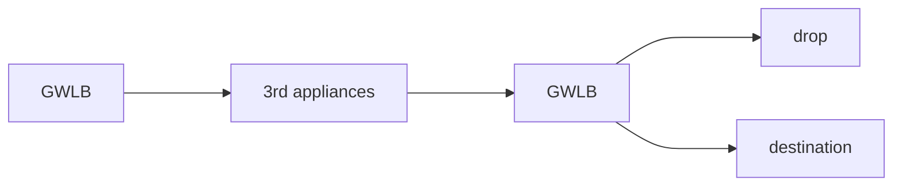

# Network

## Elastic Network Interface

A logical component in VPC that represets a virtual network card. It allows

- 1 primary IPv4, 1 or more secondary IPv4
- 1 elastic IP or 1 public IP per private IP
- 1 or more security groups
- provide mac address
- bound to AZ

```
eth0: flags=4099<UP,BROADCAST,MULTICAST>  mtu 1500 (primary ENI)
    some IPv4 address
eth1: flags=4099<UP,BROADCAST,MULTICAST>  mtu 1500 (secondary ENI)
    some IPv4 address
```

> note above is not accurate and only meant for giving an example

ENI can be create independently and connected to instance on the fly. It can be
used as network failover. Manual created ENI persist when instance is
terminated.

## Elastic Load Balancer (ELB)

A load balancer acts as a single point of access through static DNS  and
forwards traffic to instances to spread load, have seamless failure handling of
downstream instance. ELB is able to do health check, ssl termination, enforce
stickiness with cookies. It is high available across AZ and separates public
traffic from private traffic. ELB is managed by AWS with few tuning knobs.
Upgrades, maintenence are all done behind the scene. ELB integrates well with
other AWS services. ELB healthcheck is done by checking on a port and route to
decide if traffic is forwarded.

- CLB: HTTP, HTTPS, TCP, TLS/SSL (secured TCP)
- ALB: HTTP, HTTPS, websocket
- NLB: TCP, TLS, UDP
- GWLB: operates at OSI L3 IP protocol

EC2's security group should be used as ELB's security group such that ELB's
accepts all EC2's incoming traffic.

### Application Load Balancer (ALB)

Is a L7 load balancer that supports,

- HTTP across multiple machines (target group) or multiple application in same machine/containers
  - route to different target groups by configuring listener rule
    - based on url path
    - based on hostname in path
    - based on query string/headers
- HTTP/2 and websocket
- redirects (HTTP to HTTPS) and integrates with AWS certificate manager
- high availablity with minimum 2 AZ setup
- microservices and container based application
- port mapping to dynamic route (ECS?????)
- route to multiple target group
- health checks at target group level
- gets fixed hostname
- application sees true client IP in header `x-forwarded-for`
  - including port with `x-forwarded-for-port` and proto `x-forwarded-proto`

Target group can be EC2 (optionally managed by ASG), ECS tasks, lambda
function (tranlated to JSON event), IP address (must be private e.g. on prem
servers).

It is recommended to only allow instance in target group to accept inbound
traffic from loab balancer.

### Network Load Balancer (NLB)

A L4 load balancer that support TCP and UDP load balancing.

- extreme high performance: at million request per second
- low latency ~100ms (vs ALB ~400ms)
- on static IP per AZ and support elastic IP assignment
  - good for whitelisting specific IP
  - limit application exposure to limited IPs
- minimum 1 AZ
- health check only for TCP and HTTP(s)

Target group can be EC2, IP address (private), ALB.

### Gateway Load Balancer (GWLB)

Deploy, scale and manage fleet of 3rd party network virtual applicance in AWS.
Basically directing traffic to firewall/intrusion detection and prevention
system/deep packet inspection/payload manipulation at L3 network level with
network packages. It is transparent to incoming traffic and acts as single
entry/exit point. It can load balance the traffic to the appliances. It uses
GENEVE protocol on 6081 port.



Target group can be EC2 instances or IP address (private).

### Sticky Sessions/Session Affinity

ELB allows client to always connect to same instance behind load balancer (
only ALB/NLB) using coockie and expiry control at a cost of potential
unbalanced load.

- applicaiton based cookie
  - custom cookie generated by application
    - can specify any custom attribute required by applicaiton
    - cookie name must be unique for each target group and not `AWSALB*`
  - application cookie generated by load balancer
    - uses `AWSALBAPP` as cookie name
- duration based cookie
  - generated by LB with name `AWSALB`

Is setup by enabling settings under `attribute` tab.

### Cross Zone Load Balancing

For ALB it is enabled by default (disable at target group) and is free of
charges for inter AZ data.

For NLB and GWLB is default disabled and is chargeable for inter AZ data. To
enable for NLB and GWLB at `attribute` tab.

## SSL/TLS

> check [network ssl](../../Network/Interview%20Question.md#3.-explain-TLS-handshakes-(SSL)).

When using TLS on ELB, a HTTPS listener must be setup with appropriate
certificates from ACM/IAM/import (X.509). Default to have one and optional a
list of certification for multi domain support. Client can use server name
indication (SNI) to specify hostname. It is also possible to support older
versions of TLS/SSL using a security policy.

### Server Name Indication

Address the problem of loading multiple SSL certificates to on server to serve
multiple sites (multiple listeners). The client specify the host name and
server finds the appropriate certificate or fallback to default. Only ALB, NLB
and CloudFront supports it.

## Connection Draining (CLB) and Deregistration Delay (ALB/NLB)

Time to complete in-flight requets while the instance is de-regestering or
unhealthy i.e. stop sending new request to EC2. Can be set as 0~3600 seconds.

