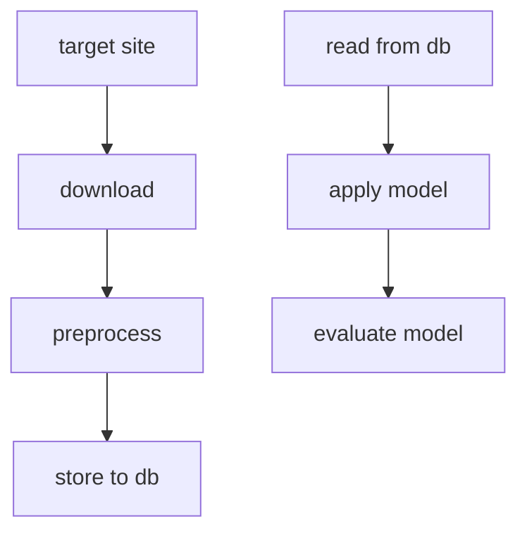

# Web Scraping

web scraping at your own risk. there involves lots of rule and regulation on scraping data, especially user information (PDPA)

## goal

web scrap news, text and corpus for NLP learning in addition to whatever that can be obtained from published datasets.

it should be something doable given we are just scraping text here, nothing fancy here.

## backlog

- [ ] POC
- [ ] database setup
- [ ] complete Learning Scrapy note taking