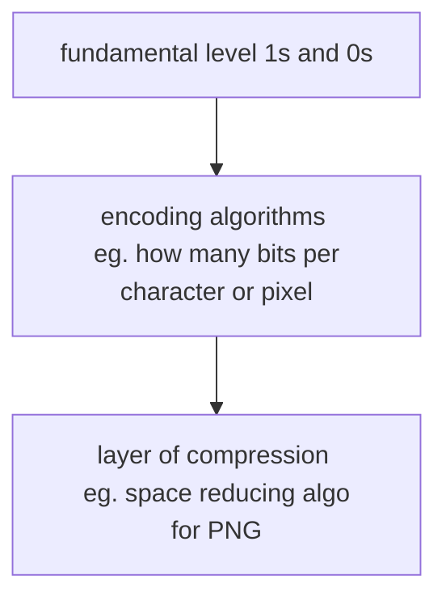

[TOC]

# Reading Documents

the internet is not just a collection of text based website interweaved with multimedia content. the fundamental of internet is a **content agnostic vehicle for transmitting files**. files are not just restricted to HTML, HTML is a way to present information, it could be email, video, pdf and etc.

## Encoding

encoding tells the application / software how to interpret (decode) the document its handling, which usually can be deduced through file extension.



## text

plain text document can be read directly without creating BS object as its counterproductive since no html to be parsed. text can be parsed into string easily how ever without html tags we might need to write some functions to analyze and retrieve desired content.

````python
from urllib.request import urlopen
textPage = urlopen('xxx/chapter1.txt')
print(textPage.read())
````

### text encoding

ASCII 7 bits with 0 padding in front (14% larger storage required and only 128 unique characters)

UTF-8 (universal character set - transformation format 8 bit) 8 bit here refers not to the size of every character but to the smallest size that a character required to be displayed thus the actual size is flexible which ranges from 1 byte to 4 byte. UTF-8 is made compatible for 1 byte character to be exact to ASCII. However its still wasting 1 bit (thus not real 256 character) also for multiple byte characters additional bits are spent on bits checking to prevent corruption, eg for a full 4 byte character, out of 32 bits only 21 bit are used for character encoding.

a universal language-encoding standards means that for non-latin (english) characters will used up more storage space, even it has less than 100 characters. ISO is to solve this issue, by using the padding 0 to create 128 special characters for all languages that requires them and works best with european language as they are highly reliant on latin alphabet (and additional special characters). side note, ISO is less popular now.

````python
# an example of decoding in UTF-8
html = urlopen('some site')
bs = BeatifulSoup(html, 'html.parser')
content = bs.find('div', {'id': 'some id'}).get_text()
content = bytes(content, 'UTF-8') # why this? from whatever format read it as (raw) byte format
content = content.decode('UTF-8') # byte to string
````

usually we can find encoding in html meta tag

```html
<meta charset='utf-8'>
<!- or -!>
<META HTTP-EQUIV='Content-Type' Content='text/html; charset=iso-8859-1'
```

## csv

python csv library made assumption that the given csv is on local storage thus might need to workaround on this situation

- download the csv
- retrieve the file as string from web and wrap the string in a StringIO object to make it behave like a file (preferred as it doesnt takes up hdd)

```python
# ...
from io import StringIO
import csv

data = urlopen('.../file.csv').read().decode('utf-8', 'ignore')
dataFile = StringIO(data)
csvReader = csv.reader(dataFile)
# or using DictReader to avoid csv 1st row as column name

for row in csvReader:
	print(row)
# expected output ['w1', 'w2']
```

using DictReader will have some overhead but its usually worth the time.

## pdf

pdf is one of the better file format for server side viewing (compared to eg. docx), although one might argue why pdf when html can be load faster. there are two types of pdf document can be parsed, one is text based pdf and the other is vector based image. python pdf parser might not be best suited in production code, some are more suitable to be used as a cli tool. do take note most parser likely to work best with pure text pdf.

## word document

word files are designed for content creation not sharing. to parse word document, we usually read docx file as byte object, unzip it into xml and use BS to parser it with the xml parser or using python-docx library.