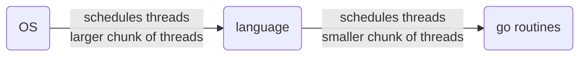
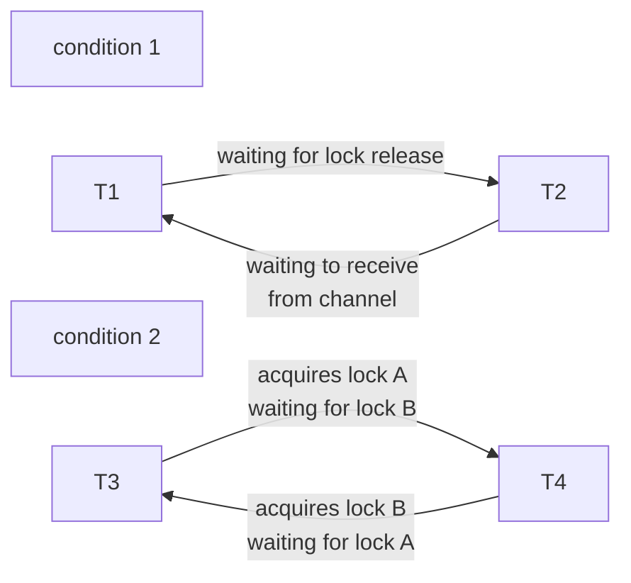

[TOC]

# RPC and Theads

## Go lang (why go?)

- abstraction
- threads (go routines) / locking
- threads synchronization
- convenient RPC package
- type and memory safe (? reddit comment says not exactly safe, why?)
- garbage collected

> garbage collection and threads combination is particularly outstanding, finding and bookkeeping the *last* thread that is using the shared object is difficult

## [threads](../Interview/OS.md)

main tool to manage concurrency in programs (within this course context, may not apply to production world). concurrency is important in distributed system as one to many communication is the core of this subject. multithreads means multiple registers, stack and counter for each of the threads. the stack is **within** the same address space, and can be referred to between the threads (we typically don't do that).

### IO concurrency (? to follow up with more content for interview)

an legacy naming, used to be the waiting for read from disk operation to be completed and thus a second thread can execute or compute. a more modern context and course fitting will be a program that has launched RPC requests to different servers on the network and waiting for many replies at the same time.

### parallelism

multiprocessing, true parallel, able to use twice as many CPU cycles per second, not a big deal in this course

### convenience / periodical work

background work, ie we wouldn't want to be worrying on checking timing etc in the main code

> is the overhead worth? usually it is, unless we are firing 10^7 request per second.

### alternative

even-driven programming / asynchronous programming. a single thread program that's having an infinite system loop waiting for input / event that might trigger processing, record to a table that keep track of the state and etc. however its still easier to write straightforward code (eg. js we need to await all input which could be a mess)

- difficult to harness multiprocessing (?)
- lower overhead compare to multithreading

> eg. 1M users with multithreading we need 1M of stacks etc, which is not the case for event-driven programming

### some clarification on processes and threads

in UNIX system a process is a single program we are running, single address space, single memory. multithreads can exists in a process

context switching, ie when OS determines when to stop CPU processing on a process and give to another CPU

threads is still allocated by OS, thus similarly threads switching works in a similar fashion. also another abstraction could happen in the language level where another scheduling algorithm determines the switching



## challenges in writing threaded code

### shared data

we could have a global variable and two threads trying to add 1 into it and the result is global variable equals to 1 instead of two (atomicity of a instruction / machine code context here), while increment actually yields 2 etc.

> race condition? or RACE?

thus we introduces the lock to prevent such problems, ie only modify the data if lock is held (?)

```go
mu.lock()
n = n +1
mu.unlock()
```


> go doesn't know which variable to lock, it only allows a thread with lock to work the the variables, the rest will be waiting in the line

> another discussion on locks, particularly a private lock ie lock at data structure level, might be a good strategy however if we need to communicate within two data structure we could get into dead lock problem or cycling problem, and the solution is to lift the lock to call level ie function level, which is something like what go does

### coordination

threads in the above implementation doesn't work with each other, they just want to run out. but we may want to have interaction between threads.

- channels in go
- sync condition
- wait group

### deadlock



usually we will observe program halts but no crash or error message

## web crawler

usually url graph is cyclic, thus we would like to prevent to call the same url twice. there exists a situation where the url is not registered to other threads. and also the halting of the crawler need to be written

```go
package main

import (
	"fmt"
	"sync"
)
func Serial(url string, fetcher Fetcher, fetched map[string]bool) {
    if fetched[url]{
        return
    }
    fetched[url] = true
    urls, err := fetcher.Fetch(url)
    if err != nil {
        return
    }
    for _, u := range urls {
        Serial(u, fetcher, fetched)
        // go Serial(u, fetcher, fetched), we will see only one url instead of 5, and others will be seen in later calls
    }
    return
}

type fetchState struct {
    mu sync.Mutex
    fetched map[string]bool
}
// pointer and map
func ConcurrentMutex(url string, fetcher Fetcher, f *fetchState) {
    f.mu.Lock()
    already := f.fetched[url]
    // the line above is the table that tracks the visited urls, shared by all threads
    // surrounded by lock to prevent race condition
    f.fetched[url] = true
    f.mu.Unlock()
    if already {
        return
    }
    urls, err := fetcher.Fetch(url)
    if err != nil {
        return
    }
    var done sync.WaitGroup
    for _, u := range urls {
        done.Add(1)
        // why bother passing u but not fetcher and f, because we wanted to have a private / static variable for the inner function
        go func(u string) {
            ConcurrentMutex(u, fetcher, f)
            done.Done()
            // or move done.Done 1 line above with defer done.Done()
        }(u)
    }
    done.Wait()
    return
}

func worker(url string, ch chan []string, fetcher Fetcher) {
	urls, err := fetcher.Fetch(url)
	if err != nil {
		ch <- []string{}
	} else {
		ch <- urls
	}
}

func master(ch chan []string, fetcher Fetcher) {
	n := 1
	fetched := make(map[string]bool)
	for urls := range ch {
		for _, u := range urls {
			if fetched[u] == false {
				fetched[u] = true
				n += 1
				go worker(u, ch, fetcher)
			}
		}
		n -= 1
		if n == 0 {
			break
		}
	}
}

func ConcurrentChannel(url string, fetcher Fetcher) {
	ch := make(chan []string)
	go func() {
		ch <- []string{url}
	}()
	master(ch, fetcher)

func main() {
	fmt.Printf("=== Serial===\n")
	Serial("http://golang.org/", fetcher, make(map[string]bool))

	fmt.Printf("=== ConcurrentMutex ===\n")
	ConcurrentMutex("http://golang.org/", fetcher, makeState())

	fmt.Printf("=== ConcurrentChannel ===\n")
	ConcurrentChannel("http://golang.org/", fetcher)
}
type Fetcher interface {
	// Fetch returns a slice of URLs found on the page.
	Fetch(url string) (urls []string, err error)
}

// fakeFetcher is Fetcher that returns canned results.
type fakeFetcher map[string]*fakeResult

type fakeResult struct {
	body string
	urls []string
}

func (f fakeFetcher) Fetch(url string) ([]string, error) {
	if res, ok := f[url]; ok {
		fmt.Printf("found:   %s\n", url)
		return res.urls, nil
	}
	fmt.Printf("missing: %s\n", url)
	return nil, fmt.Errorf("not found: %s", url)
}

// fetcher is a populated fakeFetcher.
var fetcher = fakeFetcher{
	"http://golang.org/": &fakeResult{
		"The Go Programming Language",
		[]string{
			"http://golang.org/pkg/",
			"http://golang.org/cmd/",
		},
	},
	"http://golang.org/pkg/": &fakeResult{
		"Packages",
		[]string{
			"http://golang.org/",
			"http://golang.org/cmd/",
			"http://golang.org/pkg/fmt/",
			"http://golang.org/pkg/os/",
		},
	},
	"http://golang.org/pkg/fmt/": &fakeResult{
		"Package fmt",
		[]string{
			"http://golang.org/",
			"http://golang.org/pkg/",
		},
	},
	"http://golang.org/pkg/os/": &fakeResult{
		"Package os",
		[]string{
			"http://golang.org/",
			"http://golang.org/pkg/",
		},
	},
}
```

one problem with the crawler above is there is no theoretical limit on how many concurrent threads can exists, which is bad as memory can run out quickly, thus we can introduce a thread pool

## reference material

- effective go
- go race detector

```bash
go run -race crawler.go
```

> one pitfall is that its not static analyzing, its check on runtime, given a code that does not executes (don't write to memory) no race is detected