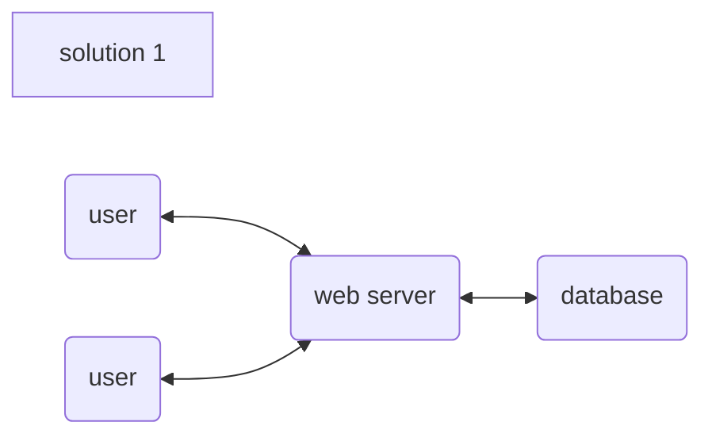
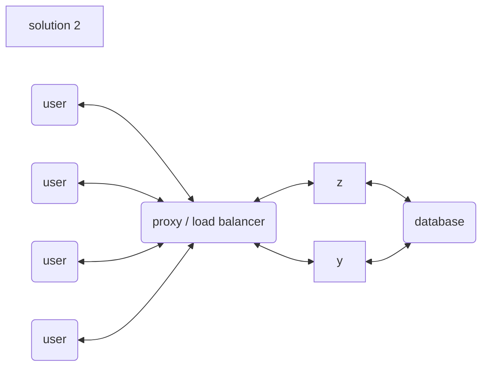
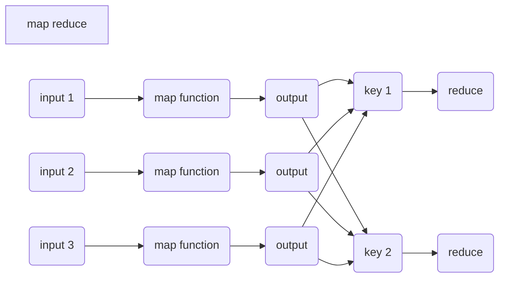
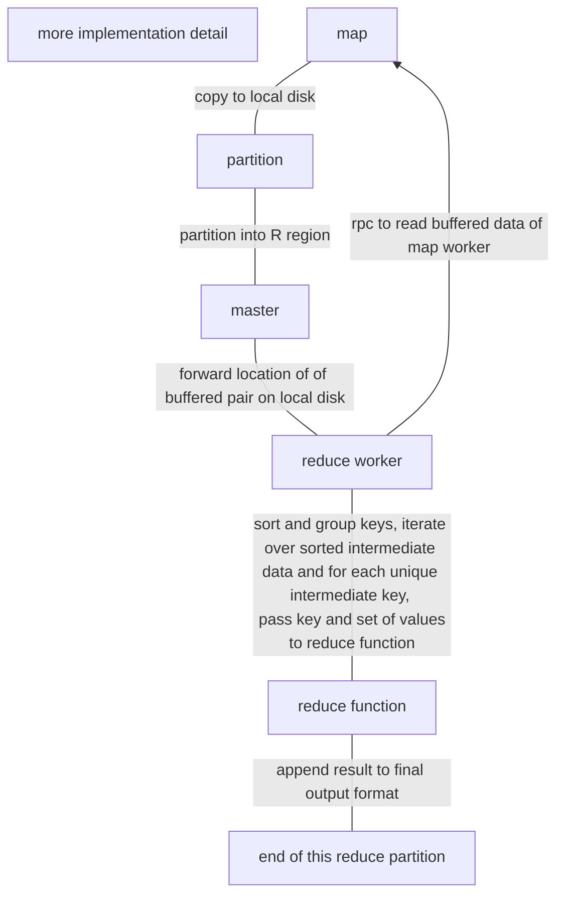

[TOC]

# introduction to distributed systems

> paper of the week: mapreduce

[MapReduce: Simplified Data Processing on Large Clusters](http://static.googleusercontent.com/media/research.google.com/en//archive/mapreduce-osdi04.pdf)

## why distributed systems? 

- parallelism / efficiency
- fault toleration
- physical reasons (ie. international banks)
- security (to isolate information)

## challenges

- concurrency / timing dependencies
- unexpected failure pattern, ie. partial failures, power failure, network unreliable etc.
- interactions between machines
- performance

> measuring fault tolerance and actual performance gain

three main topic will be discussed: storage (well defined), communication and computation

## implementation

- [remote procedure call](#some findings on RPC (there is a lecture full on this, this is just a preview))
  - to mask the fact we are communicating over an unreliable network
- threads
  - to harness multi-core computer and present it as a way of structuring concurrent operations
- concurrency control (eg. locks)

## performance

- scalability and speed-up
  - expectation vs reality (ie does 2x hardware translates into 2x performance?)



solution 1 will start to see problem with the growth of concurrent users




solution 2 resolved the issue by horizontally scaling out with more servers / hardware. however its not infinite scalable, because the database will be overloaded. also this is a point where we need to redesign the architecture as there is no straightforward way to refactor a single database (into multiple database)

## fault tolerance

its not uncommon for single computer to maintain 99.99% if not 100% uptime for long amount of time.

> however if we have 1000 pc and expected it to up for 1 year, we also expecting to see ~3 pc down per day

for us its the goal to mask this faults from our users.

#### metrics 

- availability (up time)
  - under **certain set of failures** we can still provide service
- recoverability

#### what's available in the toolbox?

- non-volatile storage for checkpoint / log for the state of the system, however nv-storage is expensive to update. thus usually a fault tolerant high performance system will have clever ways to avoid writing to non-volatile storage too much.
- replication and management of replication system, sync issues

## consistency

for a single computing system there is no ambiguity, ie if we send put request {'k': 'v'} to the server and try to get 'k', its expected to return 'v' at all time. however if its a distributed system, it may not be the case due to replication / caching. we need to define more rules for put and get to attain the **same semantics** for a single computing system

> strong and weak consistency

weak consistency: do not guarantee anything like a get sees the value written by the most recent put (for an unbounded amount of time), its cheaper to achieve weak consistency spec than the strong consistency (less communication)

if we are using replication for fault tolerance, we will want the replicas to have independent failure probability and uncorrelated failure, by for example separate the servers from a single rack to two different continent, however the physical distance will limit the rate of communication

## mapreduce

background: google want to run computations on terrabytes of data on thousands (not referring to actual number) of machines in short amount of time and want engineers to focus on solving problem instead worrying about distributed system - with a framework inplace. the application engineer can just write a map and a reduce function without knowing anything about distribution systems

mapreduce starts by assuming that there is some input split up into chucks, and apply map functions to each chucks. then it produces a list of k, v pairs as output (intermediate output) of the map function. next, the mapreduce framework collects all (same) instances from all maps' output of each key and hand to the reduce function. a good example is the work count mapreduce job and a real life example will be the execution of google's pagerank algorithm.



some terminology, a job is the entire process, any sub job is called a task. the downside of mapreduce is not all job can fit into this pattern (key value and mathematical operation), also in the world of the paper is written there is network throughput constrain as the network can only move this amount of data in 1 sec. the trick is if implementing the GFS on the same machine and the master only sends map function to the slave, thus its only reading from local disk. the next constrain is when we **shuffle** (making rows in to columns). 

the paper tested with batch processing but throughout the years the implementation has enabled streaming approach. on fault tolerance, we also have some network communications as we will be keeping multiple copies of output in GFS (typically 3)

> also here we illustrates a programmer's view however this course focuses on the workers / task itself

##  mapreduce google 2004 paper reading

idea from Lisp primitive map and reduce. 

more use case of mapreduce computation

- distributed grep: map emits if a line matches a certain pattern, reduce basically a identity function that return input as output
- count URL access frequency
- term vector per host: count most important words that occur in a document or a set of documents

> project 01: get a few ML papers and find out what's the highest frequency word
>
> ML papers in pdf format, but parsing shouldn't be the focus of the project, use poem instead

- distributed sort: basically merge sort on steroids?

> take note the original mapreduce paper doesn't implements shuffle, or to be precise they didn't separate it out



typically there will be total of *R* output (user defined) and no need to combine the outputs into a single file as they are often passed into another mapreduce call or use them from another distributed application that is able to deal with the partitions

#### master's data structure

masters stores several data structure. its the conduit where location of intermediate file is passed from map machine to reduce machine

- (for each) map and reduce task's state (idle, in-progress or completed) and the identity of worker machine for non-idle tasks
- (for each ) completed map task the location of and size of *R* intermediate file region produced by map task

the information is pushed incrementally to workers that have in-progress reduce task

#### fault tolerance

1. worker failure
   - master check worker's heartbeat periodically, if there is no response in certain amount of time, marks that worker as fail
   - reset map worker back to idle state upon completing task, and ready to be scheduled
   - re-execution is required on failure for **map** task because their output is stored on the local disk, but not for **reduce** worker as their output is stored in a global file system
   - any reduce worker that has not read from the failed machine will be notify to read from the new worker
2. master failure
   - get master to write periodic checkpoints of the master data structures
3. semantics in the presence of failures
   - if the map and reduce operators are deterministic functions of their input values the output to be yield will be same to any non-faulting sequential execution of the entire program
   - rely on atomic commits of map and reduce task output to achieve this property
   - for non deterministic task we assume any one worker is equivalent to any single machine but between worker they are different

#### complexity

*M* & *R* will be ideally much larger than the number of worker machines. by having each worker perform many differnt task improves dynamic load balancing and speeds up recovery

master makes

> O(M+R) scheduling decision and store O(M*R) states

*M* is usually a large number while also trying to ensure each individual task is roughly 16~64MB this around 200, 000 and *R* will be a small multiple of the number of worker machines eg. 5000 for 2000 worker machines

> numbers are what google was using back then

#### backups

straggler: a machine that takes unusually long time to complete one of the last few map or reduce task with multiple reason come with it ie competition of computing resources between tasks

the general mechanism to address the problem is to get the master to schedule backup executions of the remaining in-progress tasks, the task is marked as completed whenever either primary or backup execution completes

#### refinements

1. partitioning function: decide which reduce machine should the current map function output to be passed to 
   - default partitioning is provided using hashing (hash(key) mod *R*)
   - or special partitioning eg. hash(hostname(urlkey)) mod *R* to guarantee all entries for single host to end in same output file or all urls from same host end up in same output file
2. combiner function: partial merging of data before its sent over the network. executed on each machine that performs a map task, typically the same code is used to implement both combiner and reduce, the only difference is combiner outputs intermediate file instead of final output file

> this could be implemented within mapper, at least when attempting to implement the count words mapreduce task with python, its more logical to place it within map function

3. skipping bad records: instead of fixing source code, and given the condition of analyzing big data we could skip a few bad records by installing a signal handler that catches segmentation violations and bus errors and send the sequence number to a global variable such that when master re-execute the task that sequence number is skipped
4. counters: count occurrences of various events for sanity checking

## more reference material

- [google research documents](https://research.google/pubs/pub62/)
- python generator

_____

## some findings on RPC (there is a lecture full on this, this is just a preview)

python rpc with rpyc, is this how the "remote code execution engine" works?

> idea 01: send python code as string with expected format, evaluate solution with test cases

```python
import rpyc as r
conn = r.classic.connect('localhost')
conn.execute('print(something)')
# or
conn.execute('import math')
conn.eval('2*math.pi')

```

