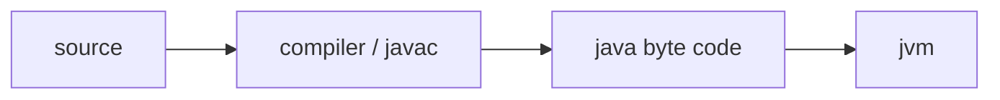
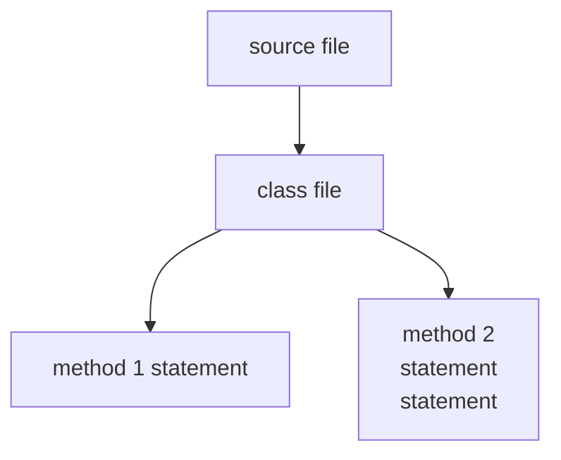

[TOC]

# introduction

this will be a very brief touch on the book head first java, 2nd edition. i will try to only jot down java specific stuffs for the record.

## why java?

written once run everywhere by



## code structure



a simple java code structure hierarchy

### source file

holds one class definition and represents a piece of your program. a minimum of one class is required

```java
public class yourClassName{
    
}
```

### class

holds one or more methods

```java
public class Dog{
    void bark(){
	}
}
```

### method

holds instruction for how a method should be performed

___

conclusion every java app need to have at least one **class** and one **main method**

```java
public class MyFirstApp{
	public static void main(String[] args){
        System.out.println("hi");
    }
}
```

- void refers to return data type
- "main method"
- input will be an array of strings, with name args

the code above will be compiled in to a new class file (.class).

we compile as follows

```bash
>> javac MyFirstApp.java
```

> what went wrong is that we should run java -cp \some\dir\classes, especially if using maven / gradle together with IJ where one might define package + class instead of single file.