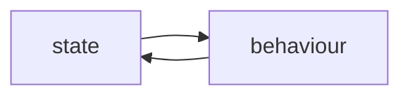

[TOC]

# object behaviour



## on state changing

using methods. method can take in parameters, a caller will pass in arguments as parameters. these values is pass by a copy. and a method can return a declared type, just like a function.

## getters and setters

methods that start with get or set to retrieve object instance variable value and modify them. instead of accessing by dot method eg. object.height, we use getters and setters to prevent accidental assignments as follows

```java
theCat.height = 0;

public void setHeight(int ht){
    if (ht > 9){
        height = 9;
    }
}
```

we could control the value of height in this manner. a good rule of thumb is to have instance variable private and set setters and getters as public methods.

> if we left out the instance variables value, all primitive have a default value eg int / char will be 0, bool will be false, object reference will be null

## on declaring and initializing

```java
// declaring
int x;
// initializing
x = 1;
```

instance variables can be declared but not initialized, local variables must be declared and initialized before use.

## equality checking

== checks if both privimitives are the same (check bits if they are the same), or the reference object is the same (address on heap). but to check equality eg

```java
class cat(){
    
}
cat c1 = new cat();
cat c2 = new cat();

System.out.println(c1.equals(c2));
// true

// internal implementation of equals
public boolean equals(Object anObject) {
      if (this == anObject) {
          return true;
      }
      if (anObject instanceof String) {
          String anotherString = (String) anObject;
          int n = value.length;
          if (n == anotherString.value.length) {
              char v1[] = value;
              char v2[] = anotherString.value;
              int i = 0;
              while (n-- != 0) {
                  if (v1[i] != v2[i])
                          return false;
                  i++;
              }
              return true;
          }
      }
      return false;
}
```

