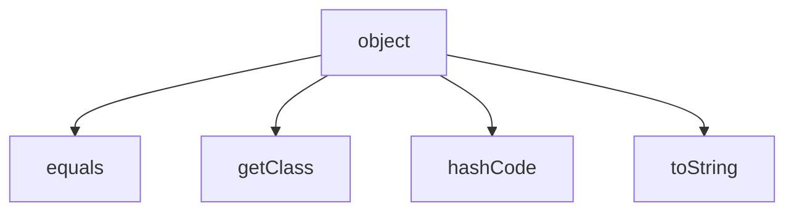

[TOC]

# serious polymorphism

interfaces for flexibility and extensibility, a 100% abstract class. to prevent users creating top level superclass and only create subclasses, we can mark up the class as `abstract`. this prevents users from `new` a superclass but still able to reference to that that superclass.

```java
abstract class Canine extends Animal{
    public void roam(){}
}

public class MakeCanine {
    public void go() {
        Canine c; // this is allowed
        c = new Dog(); // this is allowed, dog is a canine
        c = new Canine(); // this is not allowed
    }
}
```

abstract class can only be extended and referenced but not instantiated.

a class thats now abstract is called a concrete class.

## abstract methods

the method must be overridden. this is for classes that requires to be implemented more specifically in the subclasses. an abstract methods has no body, as we cant implement any generic code for it. if we are to declare an abstract method the class that holds this method should also be an abstract class.

```java
public abstract void eat();
```

abstract methods is for polymorphism, and only needed to be specified at the 1st concrete class.

```java
public class MyAnimalList {
    private Animal[] animals = new Animal[5]; // possible as we are instantiating a list of animals
    private int nextIndex = 0;
    
    public void add(Animal a) {
        if (nextIndex < animals.length) {
            animals[nextIndex] = a;
            System.out.println("animal added at " + nextIndex);
            nextIndex++
        }
    }
}
```

the superclass in java is object, every class in java extends class Object.

## caveat of polymorphic reference type Object

```java
ArrayList<Object> myDogArrayList = new ArrayList<Object>;
Dog aDog = new Dog;
myDogArrayList.add(aDog);
Dog d = myDigArrayList.get(0); // this wont compile, compiler knows that its an object but not a dog object
```

more examples

```java
public void go(){
    Dog aDog = new Dog();
    Object sameDog = getObject(aDog);
    sameDog.bark(); // wont compile, object don't have method bark
}
public Object getObject (Object o){
    return o;
}

go()
```

compiler decides whether you can call a method based on the referenced type not the actual object type.

to make the code above work, we could

```java
Object sameDog = getObject(aDog);
Dog d = (Dog) sameDog;
d.bark();
// instanceof
if (o instanceof Dog){
    Dog d = (Dog) o;
}
```

## multiple inheritance

problem with multiple inheritance

```java
class A {
    int i;
    public void method1(){}
}

class B extends A{}
class C extends A{}
class D extends B, C{} // assume this is multi inheritance syntax
```

one problem is when we call D.i which i its reference to? B or C? or if we call D.method1() which method1 will be executed?

## interface

the solution to the problem above (deadly diamond of death) is to make all methods abstract with interface.

```java
public interface Pet{
    public abstract void beFriendly();
    public abstract void play();
    // interface are implicitly public and abstract thus its optional to type out
    // semicolons and no body {} for all interface methods
}
public class Dog extends Canine implements Pet{}
```

this forces user to implement the methods in Pet interfaces. interface is universal, any class from different superclass can implement the same interface. multiple interface can be implemented by the same class.

```java
public class Dog extends Animal implements Pet, Saveable, Printable {}
```

```java
abstract class Report(){
    void runReport(){
        // setup report
    }
    void printReport(){
        // generic printing
    }
}

class SomeReport extends Report{
    void runReport(){
        super.runReport(); // run the superclass method
        // continue runnign code here
        printReport();
    }
}
```

____

## on Object



