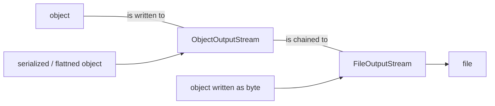

[TOC]

# serialization and file IO

objects consist of state and behavior, behavior lives in the object but states lives within individual objects, and to take a snapshot of the states, we need to serialize it into a file. in the OO way, its simply flatten the objects it self. there might be complication when we are saving for non-java application. dot ser file is basically java serialized file.

- serialization - file that holds flattened / serialized object (for java app)
- write to file - common file format, eg. csv, txt etc
- database

## serialization

### method 1: writing a serialized object to a file

```java
FileOutputStream fileStream = new FileOutputStream("MyGame.ser");
// if fname dne a new file will be created

ObjectOutputStream os = new ObjectOutputStream(fileStream);
for (i = 0; i < no_of_item_to_be_serialized; i++) {
    os.writeObject(no_of_item_to_be_serialized[i]);
}
os.close();
```

java IO api has connection streams that represents connection to destinations and sources be it network sockets or files. usually it takes two stream to work properly because OO requires one class to do one thing well. so we have FileOutputStream (connection stream) that write bytes to file and ObjectOutputStream (chain stream) to turn object into data that can be written to a stream.



serialized objects save the values of the instance variables such that an identical instance can be created in the heap. its a recursion process where during the serialization of an object A, its instance variables are serialized, together with any object that A refers to are also being serialized, so on and so forth basically serialization an object graph. this happens automatically.

to enable the serialization, implement `Serializable`

```java
public class Box implements Serializable {
    private int width;
    private int length;
    
    public void setParam(int w, int l) {
        width = w;
        length = l;
    }
    
    public static void main (String[] args) {
        Box myBox = new Box();
        myBox.setParam(4, 5);
        try {
            FileOutputStream fs = new FileOutputStream("mybox.ser");
            ObjectOutputStream os = new ObjectOutputStream(fs);
            os.writeObject(myBox);
            os.close();
        } catch (Exception Ex) {
            ex..printStackTrace();
        }
    }
}
```

- the serialization is all or nothing, thus all object that is being referred to must also implements `Serializable`
- make an object transient if we would like that object to be excluded eg. runtime specific information (network connections, threads and etc) and when we deserialize it, it will be set as null for references and defaults for primitives.
- static variables are one per class not one per object thus its not saved

```java
public class Box implements Serializable {
    transient int width; // be excluded
    private int length;
}
```

### method 2: write string to file

```java
import java.io.*;
class WriteAFile {
    public static void main (String[] args) {
        try {
            FileWriter writer = new FileWriter(“Foo.txt”);
            writer.write(“hello foo!”);
            writer.close();
        } catch(IOException ex) {
            ex.printStackTrace();
        }
    }
}
```

## deserialization

```java
FileInputStream fileStream = new FileInputStream("MyGame.ser");
ObjectInputStream os = new ObjectInputStream(fileStream);
for (i = 0; i < no_of_item_to_be_deserialized; i++) {
    Object obj = os.readObject(); // read the obj
    GameCharacter elf = (GameCharacter) one;
}
os.close();
```

## java.io.File

java.io.File class represents a file on the disk, but not representing contents of the file. its more like a file path object that can helps to verify a valid path then provide it to a FileWriter or FileInputStream.

```java
// make a File object representing an existing file
File f = new File("MyCode.txt"); 
// make a new dir
File dir = new File("mycode.txt");
dir.mkdir();
// list contents of a dir
if (dir.isDirectory()) {
    String[] dirContents = dir.list();
    for (int i = 0; i < dirContents.length; i++) {
        System.out.println(dirContents[i]);
    }
}
// get abs path
System.out.println(dir.getAbsolutePath());
// delete a file or dir and returns true if success
boolean isDeleted = f.delete();
```

## buffers

we can write to file using `FileWriter` but it writes every thing you pass to the file each and every time. it might be a big overhead compared to manipulating in memory. by chaining BufferedWriter to FileWriter the BufferWriter will hold all the stuff we write until its full. and only then the FileWriter will be told to write to disk. if we want to send data before the buffer is full, we can just flush it by calling writer.flush().

### reading buffer

```java
import java.io.*;
class ReadAFile {
    public static void main (String[] args) {
        try {
            File myFile = new File(“MyText.txt”);
            FileReader fileReader = new FileReader(myFile); // connection stream
            BufferedReader reader = new BufferedReader(fileReader); // chained stream
            String line = null;
            while ((line = reader.readLine()) != null) {
                System.out.println(line);
                // while there are still lines to read, read and print
            }
            reader.close();
        } catch(Exception ex) {
            ex.printStackTrace();
        }
    }
}
```

## versioning

between object versions there might be changes in the instance type for example and this will hurt the deserialization process. 

### serialVersionIUD

every time an object is serialized the object includes its version ID number for the object class (implicit). thus during deserialization JVM will raise exception. by explicitly including the serialVersionUID in our class will allow JVM to ignore the differences, given that we handle class changes carefully.

___

simple project - flash cards

the new java.nio classes added more features including non-blocking IO and more native capabilities, but only use it when necessary due to complexity.