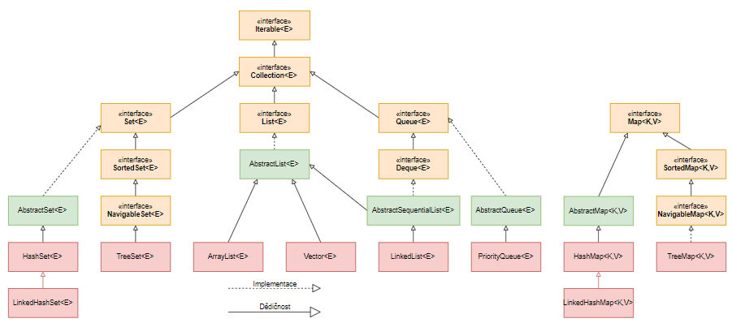

[TOC]

# data structures - collections and generics

ArrayList does not have sort method and is not the only collections.

-  TreeSet - python equivalent of sorted set
- HashMap - python equivalent of dict
- LinkedList - alternate of ArrayList with better performance for insert / delete from the middle of the collection
- HashSet - python equivalent dict + set (for quick search and unique value)
- LinkedHashMap - ?



using TreeSet might be a good idea to solve sorting problems, but with a little extra overhead. TreeSet ensures after every insert, the collection remains sorted.

to sort an ArrayList, we can see Collection class has sort method, and it takes a List as input argument, ArrayList implements List which means ArrayList can be input as the argument... thus

```java
import java.util.*;
import java.io.*;

public class Jukebox {
    ArrayList<String> songList = new ArrayList<String>();
    public static void main(String[] args) {
        new Jukebox1().go();
    }
    public void go() {
        getSongs();
        System.out.println(songList);
        Collections.sort(songList); // here is where will go wrong
        System.out.println(songList);
    }
    void getSongs() {
        try {
            File file = new File("SongList.txt");
            BufferedReader reader = new BufferedReader(new FileReader(file));
            String line = null;
            while ((line= reader.readLine()) != null) {
                addSong(line);
            }
        } catch(Exception ex) {
            ex.printStackTrace();
        }
    }
    void addSong(String lineToParse) {
        String[] tokens = lineToParse.split("/");
        songList.add(tokens[0]);
    }
}
// if we change song from string to object, we just overrides the toString method
// this is because when we call System.out.println(SongObject) it will call toString method
// and the changes to the code above is just <String> to <Song>
class Song {
    // bla bla bla...
    public String toString() {
        return title;
    }
}
// sadly it wont comple
// instead
class Song implements Comparable<Song> {
    String title;
    String artist;
    String rating;
    String bpm;

    public int compareTo(Song s) {
        return title.compareTo(s.getTitle());
    }
}
// what if we want to compare the artist too?
public class Jukebox {
    // bla bla bla...
    class ArtistCompare implements Comparator<Song> {
        public int compare(Song one, Song two) {
            return one.getArtist().compareTo(two.getArtist());
        }
    }
    public void go() {
        // bla...
        ArtistCompare artistCompare = new ArtistCompare();
        Collections.sort(songList, artistCompare);
        // bla...
    }
}
```

- in the documentation it says sort sort List \<T> which refers to generics for type-safety.
- comparator is external to the element type, eg. song. we can create as many as possible.

## more on equivalancy (cont. from 03)

what makes two objects equal? 

### reference equality

two references but there exists a single object in the heap. if we call `hashCode()` it should show the same value as long as we don't override this function. to check reference equality use `==` which compares the bits in the variables.

### object equality

two references, two objects but they are meaningfully equivalent in the sense that if we decides that two songs (from the example above) are equivalent if they shares the same title then we must override both the `hashCode()` and `equals()` function inherited from `Object`. hashCode overriding is for bit equivalency and equal overriding is for the scenario where if we call it on either object passing the other object always return true.

```java
if (foo.equals(bar) && foo.hashCode() == bar.hashCode()) {
    // reference equality and object equality
}
```

### relating to HashSet

```java
public void go() {
    getSongs();
    System.out.println(songList);
    Collections.sort(songList);
    System.out.println(songList); // sorted songList
    HashSet<Song> songSet = new HashSet<Song>();
    songSet.addAll(songList);
    System.out.println(songSet); // due to equality check fails we get duplicates
}
```

HashSet checks for duplicates with `hashCode()` value to determine where to put the object in the Set, then it also checks with `equals()` to see if they are really equals. `HashSet`'s `add()` function returns a bool to indicates if new object is added.

overriding the functions.

```java
class Song implements Comparable<Song> {
    // bla bla bla...
    public boolean equals(Object aSong){
        Song s = (Song) aSong;
        return getTitle().equals(s.getTitle());
    }
    public int hashCode() {
        return title.hashCode();
    }
}
```

**hashset search by hash value thus its fast

### a few more notes on equivalency

- if two object are equal their hashcode must be same
- `equals()` must be associative
- if two object have same hashcode doesn't require them to be equal but the opposite need to be (we can either override hashCode or both)
- default behavior of hashcode is to generate a unique identifier fore each object in the heap, if its never override nothing is equal
- default behavior of equals is to do an == comparison or in other words reference checking on heap.

### TreeSet

basically is a sorted HashSet.

## array and arraylist

array types are checked again at runtime, collection type checks only happens when we compile thus

```java
// this works
import java.util.*;
public class TestGenerics {
    public static void main(String[] args) {
        new TestGenerics().go();
    }
    public void go() {
        Animal[] animals = {new Dog(), new Cat(), new Dog()};
        Dog[] dogs = {new Dog(), new Dog(), new Dog()};
        takeAnimals(animals);
        takeAnimals(dogs);
    }
    public void takeAnimals(Animal[] animals) {
        for(Animal a: animals) {
            a.eat();
        }
    }
}
abstract class Animal {
    void eat() {
        System.out.println("eat");
    }
}
class Dog extends Animal {}
class Cat extends Animal {}
// this also works
public void go() {
    ArrayList<Animal> animals = new ArrayList<Animal>(); // replace this line
    animals.add(new Dog());
    animals.add(new Cat());
    animals.add(new Dog());
    takeAnimals(animals);
}
public void takeAnimals(ArrayList<Animal> animals) {
    for(Animal a: animals) {
        a.eat();
    }
}
// this doesn't
ArrayList<Dog> dogs = new ArrayList<Dog>();
```

this is to prevent us from adding say a Cat into the ArrayList. to avoid this behavior we can use a wildcard.

```java
public void takeAnimals(ArrayList<? extends Animal> animals) {
    // extends here means either extends or implements depending on the type
    for(Animal a: animals) {
        a.eat();
    }
}
```

the behavior with wildcard `?` is that compiler wont let us add anything to the list. we can replace `?` with `T` which can be seen in the documents but less wordy.

```java
public <T extends Animal> void takeThing(ArrayList<T> one, ArrayList<T> two);
// vs
public void takeThing(ArrayList<? extends Animal> one, ArrayList<? extends Animal> two)
```

